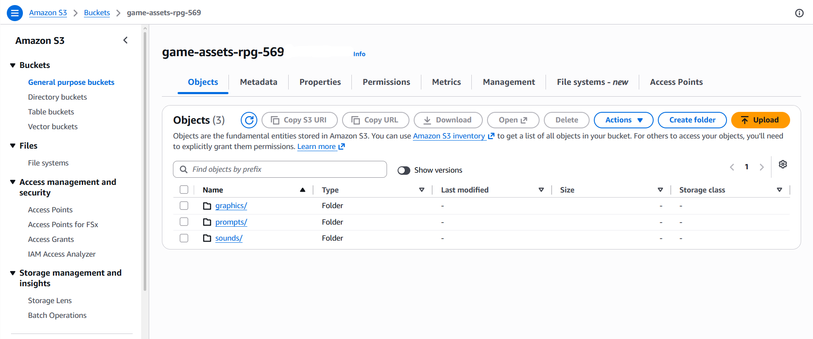

### Week 1 Objectives:

* Initialize the AWS environment & establish basic infrastructure security for the game project.

### Tasks to be carried out this week:

| Day | Task | Start Date | Completion Date |
| --- | ---- | ---------- | --------------- |
| Mon | - Enable Multi-Factor Authentication (MFA) for the AWS Root account. - Setup users and assign IAM permissions using the Least Privilege principle for Developers. | 06/22/2026 | 06/22/2026 |
| Tue | - Learn about and initialize an Amazon S3 Bucket. - Configure access permissions and CORS policies for S3. | 06/23/2026 | 06/23/2026 |
| Wed | - Upload initial Game assets to S3: UI images, character sprites, weapons, and configuration files (JSON). | 06/24/2026 | 06/24/2026 |
| Thu | - Learn fundamental concepts of Serverless Architecture (Lambda, API Gateway, DynamoDB). | 06/25/2026 | 06/25/2026 |
| Fri | - Install AWS CLI, configure profiles, and get familiar with AWS Cloud Development Kit (CDK). - Create a simple Hello World app to test the environment. | 06/26/2026 | 06/27/2026 |

### Week 1 Achievements:

During the first week, I successfully set up the foundational AWS environment and ensured security standards for the project:

* **Account Security:** Successfully enabled MFA for the Root account to prevent unauthorized access. Created an IAM User and assigned necessary permissions (Permissions policies) for services, securing interactions with AWS.
* **Asset Storage (S3):** Successfully initialized an S3 Bucket to centrally store all game assets such as UI images and character/weapon sprites. This allows the Unity game to easily fetch data via URLs without packing them directly into the build, reducing the application size.
  
  
  *S3 Bucket Structure for Assets*

* **Environment Setup & Serverless Research:** Successfully installed the AWS CLI and initialized the development environment. Spent time researching the core concepts of Serverless architecture and AWS CDK, laying a solid foundation for deploying infrastructure as code in the upcoming weeks.
