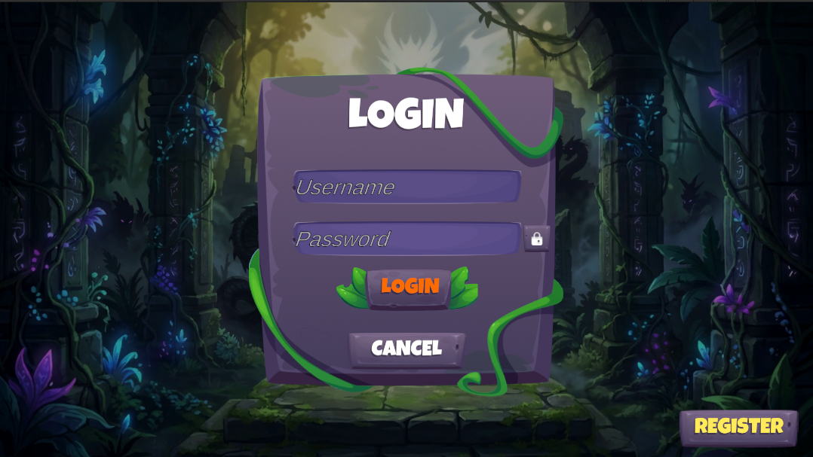
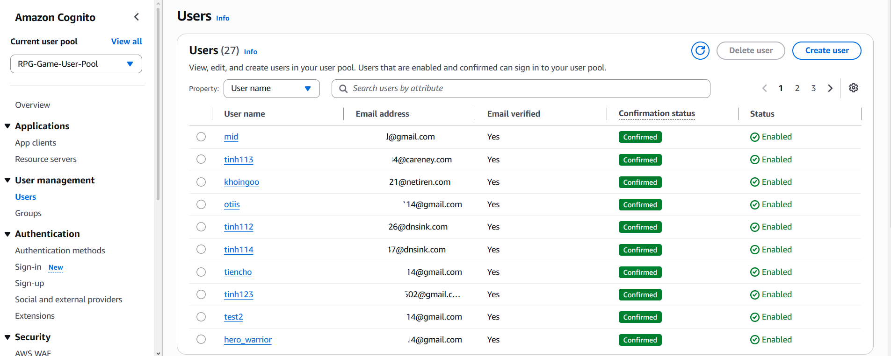

### Week 2 Objectives:

* Integrate User Authentication services (Amazon Cognito) into the game project.

### Tasks to be carried out this week:

| Day | Task | Start Date | Completion Date |
| --- | ---- | ---------- | --------------- |
| Mon | - Research Amazon Cognito service.<br>- Initialize Cognito User Pool & App Client for the game. | 06/29/2026 | 06/29/2026 |
| Tue | - Configure required user attributes (Email, Username).<br>- Develop Registration (Register) and OTP Verification (ConfirmSignUp) APIs. | 06/30/2026 | 06/30/2026 |
| Wed | - Develop Login API and handle Token Refresh (RefreshToken).<br>- Test APIs using Postman. | 07/01/2026 | 07/01/2026 |
| Thu | - Integrate the authentication flow into the C# Backend.<br>- Program JWT token management (IdToken, AccessToken, RefreshToken). | 07/02/2026 | 07/02/2026 |
| Fri | - Connect the authentication flow between Unity Frontend and Backend.<br>- Design a basic Login/Register UI in Unity. | 07/03/2026 | 07/03/2026 |

### Week 2 Achievements:

This week, the focus was on building a secure login and registration system for players using Amazon Cognito. The specific results are as follows:

* **Cognito User Pool Initialization:** Successfully configured a dedicated User Pool and App Client for the game. Set up strong password policies and email OTP verification requirements for new account registrations.
* **Authentication API Development:** Completed the programming and testing of the entire basic authentication API flow, including: Register, Login, ConfirmSignUp, and RefreshToken. The APIs work smoothly and return valid tokens.
* **Frontend Unity & Backend C# Integration:** Successfully connected the JWT token processing flow between the server and the client. The Unity game can now send login requests, receive JWT tokens, and store them securely to maintain login sessions for subsequent in-game operations. The basic login UI has also been constructed.

  
  *Unity Login UI*

  
  *Cognito Configuration*

  ```csharp
  // code from CognitoAuthService.cs, handles login in the game
  public async Task<LoginResponse> LoginAsync(LoginRequest request)
  {
      var authRequest = new InitiateAuthRequest
      {
          AuthFlow = AuthFlowType.USER_PASSWORD_AUTH,
          ClientId = _clientId,
          AuthParameters = new Dictionary<string, string>
          {
              { "USERNAME", request.username.Trim() },
              { "PASSWORD", request.password }
          }
      };

      var authResponse = await _cognitoClient.InitiateAuthAsync(authRequest);
      // Process and map user data to return to Unity Client
  }
  ```
