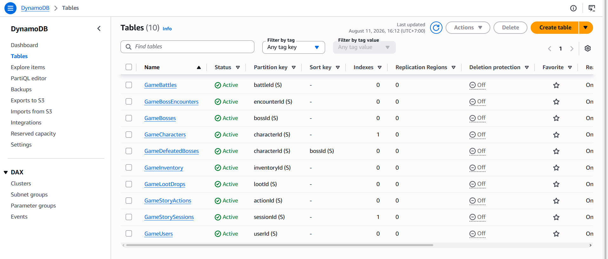
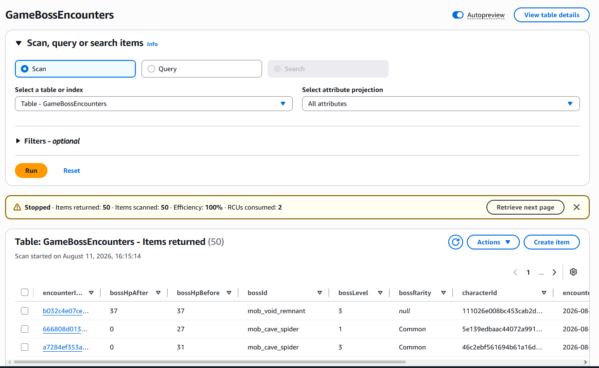

### Mục tiêu tuần 3:

* Thiết kế & Thao tác Cơ sở dữ liệu Game (DynamoDB / RDS).

### Các công việc cần triển khai trong tuần này:

| Thứ | Công việc | Ngày bắt đầu | Ngày hoàn thành |
| --- | --------- | ------------ | --------------- |
| 2 | - Khảo sát và lựa chọn loại CSDL (NoSQL vs SQL) phù hợp với cơ chế game.<br>- Thiết kế cấu trúc bảng: Tài khoản (User) và Nhân vật (Character). | 06/07/2026 | 06/07/2026 |
| 3 | - Thiết kế cấu trúc lưu trữ: Vật phẩm (Inventory), Tiến trình câu chuyện (StorySession) và Trận đấu (Battle). | 07/07/2026 | 07/07/2026 |
| 4 | - Khởi tạo các bảng DynamoDB (hoặc RDS) trên AWS Console.<br>- Thiết lập cấu trúc khóa (Primary Key, Partition Key) để tối ưu truy vấn. | 08/07/2026 | 08/07/2026 |
| 5 | - Cấu hình các Secondary Index (GSI) cho các bảng DynamoDB để phục vụ tính năng tìm kiếm phức tạp. | 09/07/2026 | 09/07/2026 |
| 6 | - Viết lớp Repository bằng C# trong Backend.<br>- Thực hiện thao tác CRUD (đọc/ghi) dữ liệu trạng thái game thời gian thực. | 10/07/2026 | 11/07/2026 |

### Kết quả đạt được tuần 3:

Tuần thứ 3 tập trung vào việc định hình cách lưu trữ và quản lý dữ liệu game sao cho hiệu quả, tốc độ truy xuất nhanh và dễ dàng mở rộng. Tôi đã hoàn thành các công việc sau:

* **Thiết kế cấu trúc CSDL toàn diện:** Phân tích và thiết kế xong mô hình dữ liệu cho toàn bộ trò chơi, bao gồm thông tin Tài khoản người chơi (User), trạng thái Nhân vật (Character), Kho đồ (Inventory), lịch sử Tiến trình cốt truyện (StorySession) và log các Trận đấu (Battle). 
* **Khởi tạo và tối ưu DynamoDB / RDS:** Thực hiện tạo bảng trên môi trường AWS thực tế. Cấu hình kỹ lưỡng các Primary Key, Partition Key và Global Secondary Index (GSI) giúp tối ưu hóa số lượng read/write capacity units, từ đó tiết kiệm chi phí và tăng tốc độ query.
* **Xây dựng Repository C#:** Đã hoàn thiện tầng Data Access trong kiến trúc Backend bằng cách viết các lớp Repository bằng ngôn ngữ C#. Các hàm này xử lý thao tác đọc/ghi liên tục trạng thái game một cách an toàn (ví dụ: lưu điểm kinh nghiệm, thêm vật phẩm vào kho).

  
  
  *Giao diện DynamoDB*
  

  ```csharp
  // Code thực tế trong file UserRepository.cs
  public async Task<User?> GetByUsernameAsync(string username)
  {
      if (string.IsNullOrWhiteSpace(username)) return null;

      var filter = new ScanFilter();
      filter.AddCondition("username", ScanOperator.Equal, username);
      var search = Table.Scan(filter);
      var docs = await search.GetNextSetAsync();
      
      return docs.Count > 0 ? JsonUtils.Deserialize<User>(docs[0].ToJson()) : null;
  }
  ```
