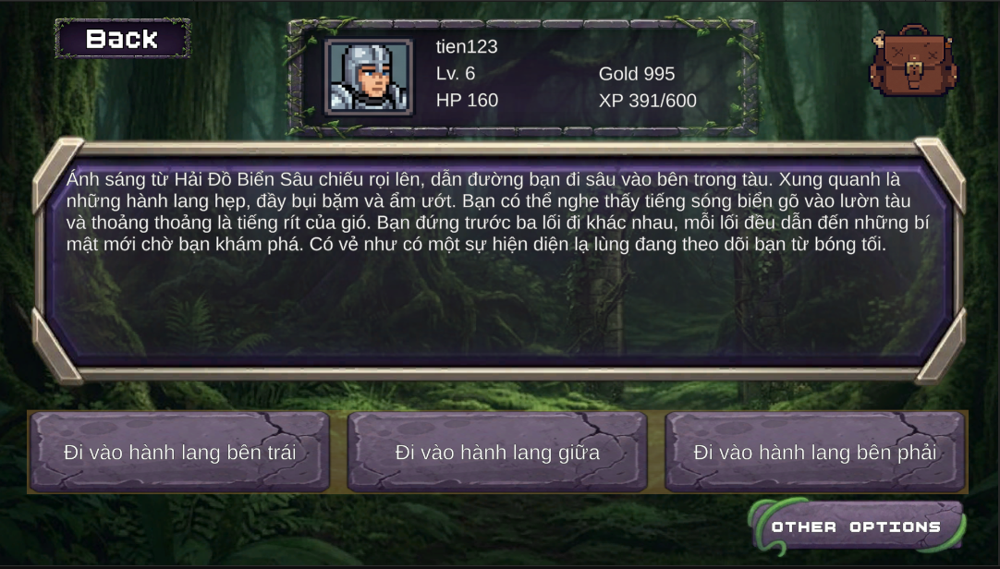

### Mục tiêu tuần 4:

* Tích hợp Trí tuệ nhân tạo sinh cốt truyện (Amazon Bedrock AI) cho hệ thống AI Storyteller.

### Các công việc cần triển khai trong tuần này:

| Thứ | Công việc | Ngày bắt đầu | Ngày hoàn thành |
| --- | --------- | ------------ | --------------- |
| 2 | - Nghiên cứu Amazon Bedrock và các mô hình ngôn ngữ.<br>- Thiết lập quyền truy cập Bedrock API thông qua IAM. | 13/07/2026 | 13/07/2026 |
| 3 | - Lập trình tích hợp AWS SDK để gọi API Amazon Bedrock từ Backend C#.<br>- Thử nghiệm gửi prompt đơn giản và nhận phản hồi. | 14/07/2026 | 14/07/2026 |
| 4 | - Viết module PromptBuilder để tự động ghép nối ngữ cảnh: thông tin nhân vật, vật phẩm đang trang bị và lịch sử các lượt chơi trước. | 15/07/2026 | 15/07/2026 |
| 5 | - Tối ưu hóa prompt để AI đóng vai trò Storyteller (Người kể chuyện).<br>- Ép kiểu dữ liệu trả về từ AI phải tuân thủ định dạng JSON nghiêm ngặt. | 16/07/2026 | 16/07/2026 |
| 6 | - Viết hàm xử lý parse JSON đầu ra để phát sinh diễn biến câu chuyện, các lựa chọn (Choices) cho người chơi và bối cảnh chạm trán Boss.<br>- Tích hợp hiển thị nội dung AI vào UI Unity. | 17/07/2026 | 18/07/2026 |

### Kết quả đạt được tuần 4:

Đây là một tuần cốt lõi để hình thành tính năng độc đáo nhất của game: AI Storyteller. Bằng cách sử dụng sức mạnh của Amazon Bedrock, tôi đã:

* **Tích hợp thành công Amazon Bedrock API:** Đã cấu hình IAM và kết nối thành công Backend C# với dịch vụ Bedrock, cụ thể là sử dụng mô hình Amazon Nova Pro. Quá trình gửi prompt và nhận kết quả văn bản diễn ra ổn định, đảm bảo mạch truyện không bị gián đoạn.
* **Xây dựng module PromptBuilder:** Tạo ra một cơ chế linh hoạt giúp tự động gom nhặt các dữ liệu hiện tại của người chơi (Tên, Level, Vật phẩm, Hành động trước đó) và bọc chúng lại thành một đoạn ngữ cảnh (Context) hoàn chỉnh. Điều này giúp AI hiểu chính xác tình huống hiện tại để đưa ra cốt truyện tiếp theo hợp lý nhất.

* **Xử lý và hiển thị JSON linh hoạt:** Khắc phục được rủi ro AI trả lời lan man bằng cách ép AI trả về dữ liệu chuẩn JSON. Dữ liệu này sau đó được hệ thống phân tách (parse) thành các thành phần: Diễn biến câu chuyện, Danh sách hành động (Choices) và Thông tin Boss, rồi hiển thị trực quan lên giao diện Game Unity.

  
  *Giao diện cốt truyện AI trong Game*

  ```json
  // Dữ liệu JSON từ AI sinh ra
  {
      "narrativeText": "Bạn đang đứng trước lối vào Tổ Rồng, ngọn lửa bên trong lóa lên, chiếu rọi lên bức tường đá...",
      "triggerBattle": true,
      "bossId": "mob_goblin_scout",
      "bossName": "Goblin Scout",
      "bossLevel": 4,
      "choices": [
          {
              "label": "Tiến vào Tổ Rồng",
              "description": "Bước vào bên trong Tổ Rồng, tìm kiếm lõi lửa bảo hộ."
          },
          {
              "label": "Nghỉ ngơi và phục hồi",
              "description": "Tìm một nơi an toàn để nghỉ ngơi và phục hồi sức khỏe."
          }
      ]
  }
  ```
