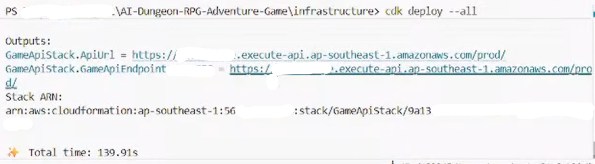

### Week 6 Objectives:

* Cloud Infrastructure Automation (Infrastructure as Code - AWS CDK).

### Tasks to be carried out this week:

| Day | Task | Start Date | Completion Date |
| --- | ---- | ---------- | --------------- |
| Mon | - Learn about the concept of Infrastructure as Code (IaC) and the AWS CDK tool.<br>- Initialize a CDK project using C#. | 07/27/2026 | 07/27/2026 |
| Tue | - Write source code defining CognitoStack (User Pool, App Client) and DatabaseStack (DynamoDB). | 07/28/2026 | 07/28/2026 |
| Wed | - Write source code defining LambdaStack (handler functions) and ApiStack (API Gateway). | 07/29/2026 | 07/29/2026 |
| Thu | - Add C# code to define Storage (S3) and Monitoring (CloudWatch).<br>- Experiment with splitting the infrastructure code into multiple files (Stacks) to keep it organized. | 07/30/2026 | 07/30/2026 |
| Fri | - Practice running CDK CLI commands (`cdk synth`, `cdk deploy`, `cdk destroy`).<br>- Evaluate flexibility in resource management. | 07/31/2026 | 08/01/2026 |

### Week 6 Achievements:

This week, I started getting familiar with the concept of "Infrastructure as Code" (IaC) through the AWS CDK tool. Instead of manually creating each resource on the AWS website, I used code to automate this process:

* **Using C# code to create AWS infrastructure:** Instead of clicking around the AWS console to create every DynamoDB table or Lambda function, I learned how to use C# (a language I already know well from Unity) to define the infrastructure. Writing it in code helps me avoid mistakes and prevents me from forgetting configuration steps if I accidentally misclick on the web interface.
* **Learning to organize infrastructure code:** Initially, I tried writing everything in one big file, but it got too long and messy. So, I learned how to split it into smaller modules (called Stacks) like Database, API, and Lambda. Even though it was a bit confusing at first to figure out how to pass data between these files, once I got used to it, the code became much cleaner and easier to debug.
* **Flexible Resource Management:** Mastered the use of CDK CLI commands. As a result, I can spin up a complete copy of the entire system (deploy) in just a few minutes, and completely tear it down (destroy) safely when no longer needed, optimizing costs.

  
  *cdk deploy terminal interface*

  ```csharp
  // Code declaring User Pool in CognitoStack.cs
  public CognitoStack(Construct scope, string id, IStackProps? props = null) : base(scope, id, props)
  {
      UserPool = new UserPool(this, "GameUserPool", new UserPoolProps
      {
          UserPoolName = "RPG-Game-User-Pool",
          SelfSignUpEnabled = true,
          AutoVerify = new AutoVerifiedAttrs { Email = true },
          PasswordPolicy = new PasswordPolicy { MinLength = 8, RequireDigits = true }
      });
  }
  ```
