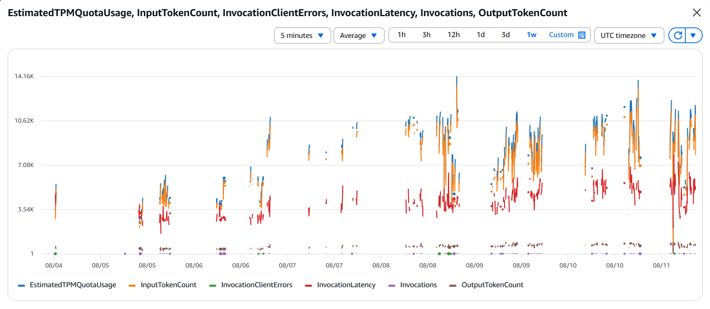
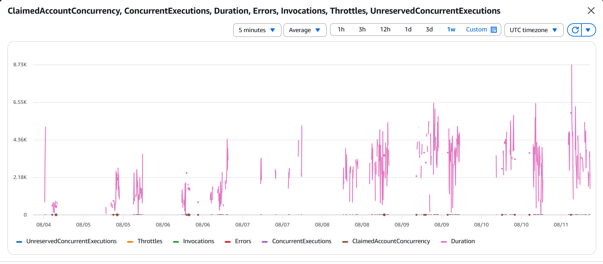

### Mục tiêu tuần 7:

* Bảo mật, Giám sát & Tối ưu chi phí vận hành hệ thống AWS.

### Các công việc cần triển khai trong tuần này:

| Thứ | Công việc | Ngày bắt đầu | Ngày hoàn thành |
| --- | --------- | ------------ | --------------- |
| 2 | - Rà soát lại code Backend, đưa các thông tin cấu hình nhạy cảm ra khỏi source code. - Dùng biến môi trường (Environment Variables) cho các hàm Lambda. | 03/08/2026 | 03/08/2026 |
| 3 | - Kiểm tra lại quyền IAM Role của các Lambda để đảm bảo việc kết nối tới DynamoDB và Bedrock diễn ra an toàn. | 04/08/2026 | 04/08/2026 |
| 4 | - Dùng CloudWatch tạo Dashboard (RPG-Game-Backend) để tiện theo dõi các chỉ số quan trọng của hệ thống. | 05/08/2026 | 05/08/2026 |
| 5 | - Cài đặt tính năng cảnh báo tự động (Alarm) gửi thông báo nếu các hàm Lambda bị lỗi quá nhiều. | 06/08/2026 | 06/08/2026 |
| 6 | - Vào AWS Cost Explorer kiểm tra lại chi phí. - Dọn dẹp bớt các tài nguyên dư thừa (Snapshot cũ...) để tiết kiệm tiền. | 07/08/2026 | 08/08/2026 |

### Kết quả đạt được tuần 7:

Sau khi hệ thống cơ bản hoàn thiện, tôi dành riêng tuần này để đảm bảo game vận hành không chỉ trơn tru mà còn an toàn và tiết kiệm:

* **Bảo mật và cấu hình:** Thay vì gõ trực tiếp thông tin nhạy cảm vào code, tôi đã chuyển sang dùng Biến môi trường (Environment Variables) cho Lambda. Việc kết nối tới Database (DynamoDB) và AI (Bedrock) cũng được phân quyền bằng IAM Role, giúp code đưa lên GitHub an toàn và gọn gàng hơn.
* **Giám sát hệ thống với CloudWatch:** Tôi đã tạo một Dashboard trên CloudWatch có tên `RPG-Game-Backend` để dễ dàng theo dõi tình trạng của game. Đặc biệt, tôi có cài thêm tính năng Alarm để tự động báo động mỗi khi các hàm Lambda xử lý logic gặp lỗi, giúp việc sửa lỗi sau này nhanh chóng hơn.
* **Tối ưu chi phí:** Dành thời gian xem lại biểu đồ chi phí trên AWS Cost Explorer để xóa đi các tài nguyên chạy ngầm không sử dụng, tránh mất tiền oan khi vận hành.

  
  
  *CloudWatch Monitoring Dashboard*
