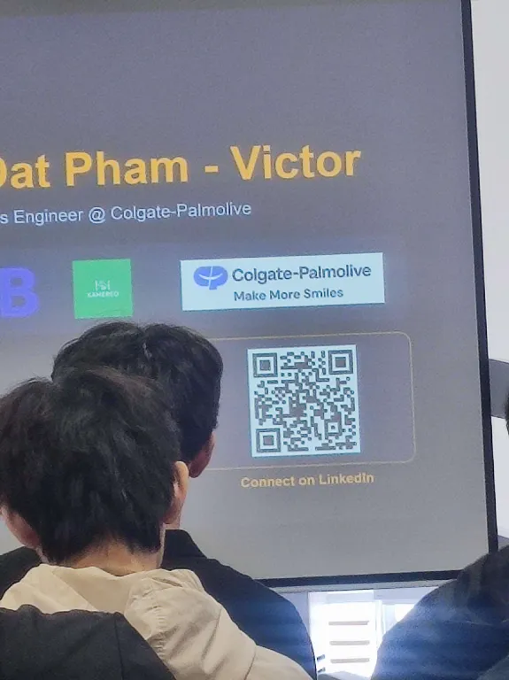

# Summary Report: "AWS First Cloud Journey AI Meetup"

### Event Objectives

- Equip students and young developers with practical cloud architecture blueprints on AWS (e.g., building a scalable URL shortening service).
- Provide career insights on data analytics roles, MNC hiring processes, and multinational corporate cultures.
- Share real-world DevOps experiences, day-to-day responsibilities, and key career fundamentals.
- Present a structured 8-step roadmap for professional growth from student curiosity to AWS Partner and community leadership.

### Speakers

- **Dinh Trung Kien** – Lead Developer at a Startup
- **Nguyen Minh Tho** – Student
- **Dat Pham** – Data Analytics Engineer (Kamereo & Colgate-Palmolive)
- **Cuong Nguyen** – Process Engineer (Colgate-Palmolive)
- **Trong H. Truong** – DevOps Engineer @ Endava Vietnam
- **Danh Hoang Hieu Nghi** – AI Engineer, AWS Community Builder, and AWS Student Builder Group Leader

---

### Key Highlights

#### 1. Designing a Scalable URL Shortener on AWS (Kien & Tho)
- **Problem Statement:** A standard URL shortener translates long URLs into short codes. A simple model (User → Frontend → Backend → Database) is cheap and easy to build but suffers from high read latency, single points of failure (SPOF), and is highly difficult to scale when traffic surges.
- **Cloud Architecture Blueprint:**
  - **Edge Security & Routing:** Managed via **Amazon Route 53** (DNS), **Amazon CloudFront** (CDN) for caching, and **AWS WAF** (Web Application Firewall) to filter malicious traffic. Security is reinforced using **AWS Secrets Manager**, **AWS KMS**, **AWS IAM**, and **AWS Certificate Manager**.
  - **Frontend:** Deployed and managed seamlessly through **AWS Amplify**.
  - **Backend Compute:** Deployed as SpringBoot containers on **AWS Fargate** (Amazon ECS) behind an **Application Load Balancer (ALB)**, distributed across multiple Availability Zones (AZs) for high availability.
  - **Database & Cache:** Built on **Amazon DynamoDB** (NoSQL primary store) and **Amazon ElastiCache for Redis** (located in a private database subnet) to accelerate read/write latency.
- **Inside the Architecture:**
  - **Key Generation Service (KGS):** To prevent key collisions and runtime overhead, a dedicated service running on ECS containers pre-computes unique short codes (e.g., `GpFHUcn`, `aB3xZ9q`) and pushes them to Redis using the `LPUSH key_queue` command.
  - **Create Flow:** When a user requests a short URL, the backend pops a pre-generated code from Redis using `RPOP` and writes the `{short_code: long_url}` pair directly to DynamoDB. This guarantees an instant, collision-free write process.
  - **Forward Flow:** Clicking a short link triggers a Redis lookup. If found (Cache Hit), the user is redirected immediately. If not (Cache Miss), the backend queries DynamoDB and caches the pair back into Redis for subsequent requests (Cache-aside pattern).

#### 2. Data Analytics & Corporate Culture in MNCs (Dat Pham & Cuong Nguyen)
- **Real-world Scope of Data Analytics:**
  - **Kamereo (B2B food supply platform):** Focuses on creating daily/weekly operational performance dashboards, monitoring business trends, detecting anomalies, and coordinating cross-departmentally to solve business problems.
  - **Colgate-Palmolive (FMCG MNC):** Focuses on collecting and analyzing machine data and IoT logs in manufacturing plants, identifying cost-saving opportunities, and supporting long-term digital transformation initiatives.
- **Four Core Skills:** Critical thinking, clear communication, data storytelling (turning dry numbers into actionable business recommendations, such as analyzing GMV fluctuations instead of just presenting reports), and data-driven problem solving.
- **Kamereo Live Case Study (Hanoi Operations):** Demonstrated a live operations dashboard measuring GMV growth (+0.5%), Average Order Value (AOV 913K), Daily orders (78 orders), Fulfillment Cost (FFM% 11.7%-13.2%), Last Mile Cost (LMC% 7.8%), and a 99.1% fill rate.
- **5-Stage Career Growth Mindset:**
  1. *Follower:* Executes detailed instructions and learns the ropes (Intern/Junior).
  2. *Learner:* Understands problem-solving but relies on mentor guidance; asks deep questions.
  3. *Problem Solver:* Moves away from checklist mentalities, conducts root-cause analysis, and takes ownership of output quality.
  4. *System Thinker:* Visualizes the big picture, analyzes cross-functional risk, evaluates financial impact, and optimizes workflows long-term.
  5. *Super Star:* Establishes data strategies, builds architectural visions, and mentors the next generation.
- **MNC Recruitment Process:** Consists of 4 competitive rounds: CV Screening & English HR Screening Call, Capability Test (logic/tech/supply chain tests), Professional Interview (diving deep into real cases using the **STAR** model), and Culture Fit Interview with leadership.
- **Decoded MNC Cultures:**
  - *No-Blame Post-Mortem:* Applied in tech giants; when systems fail, engineers investigate root causes to fix the system rather than penalizing individuals.
  - *Caring & Inclusive:* Applied in FMCG MNCs; prioritizes human development, diversity, and continuous improvement.

#### 3. National Context & Global Standards (Dat Pham & Cuong Nguyen)
- **Logistics & IT Evolution in Vietnam (1975 - 1997):**
  - *1975 - 1986:* Economic isolation and rationing. Logistics was manual and limited.
  - *1986 - 1995:* Doi Moi reforms and foreign diplomacy opened trade routes. Diplomacy acted as the nation's first "logistics" mechanism.
  - *1997:* Official global Internet connection on November 19, 1997, opening digital information flows.
- **FDI & Digital Factory Wave:** Driven by two domino effects: Physical (WTO/FTAs → FDI → Production → Logistics) and Digital (4G/Broadband → Smartphones → Startups → Cloud Adoption).
- **Compliance & Standards:** Moving from "getting things done" to "doing things to global standards":
  - *Physical Supply Chain:* Adhering to **GMP**, **GSP**, and **GDP** to ensure safety and quality.
  - *Digital Supply Chain (Tech/Cloud):* Complying with **ISO 27001**, **SOC 2**, and **GDPR** to secure digital assets and national data sovereignty.
  - *Philosophical Foundation:* Tri-pillar "Dong Viec" model: *Làm người* (kindness, empathy, self-governance), *Làm nghề* (solving problems with professional excellence), and *Làm dân* (responsibility to the nation, building lasting digital lifelines).

#### 4. Real-world DevOps Realities & Fundamentals (Hoang Trong)
- **Market Trends & Salaries:** Huge growth in data and infrastructure recruitment (AI/ML, Data, Cloud, Security, DevOps). DevOps/Cloud salaries range from Junior (16-28M VND), Mid (28-45M VND), Senior (45-65M VND) up to Lead/Expert (65-100M VND).
- **Scope of DevOps Work:** Context-dependent and client-oriented. A DevOps Engineer handles requests from all directions:
  - *Developers:* Debugging staging environments when local configurations work but staging fails.
  - *QA/Testers:* Recovering test environments and managing system permissions.
  - *Clients:* Incident handling, troubleshooting, and on-call rotations for production performance.
  - *Project Managers:* Release management and clarifying system ownership.
  - *Security Teams:* Scanning and patching package vulnerabilities.
  - *Finance Teams:* Investigating cloud billing spikes and optimizing infrastructure costs.
- **DevOps Core Fundamentals:** Focus on OS (Linux), networking concepts, scripting (Python, Go), Git & CI/CD pipelines, containerization (Docker), and understanding application operations.
- **Career Advice:** Do not copy-paste commands blindly; identify the real owner of the problem; ask "Why" before "How"; communication is key; and avoid trying to be a team-carrying hero. Maintain system-level thinking, automate boring tasks, and use AI (ChatGPT) without switching off your brain.

#### 5. Journey from First Cloud Program to AWS Partner (Hieu Nghi)
- **8-Step Career Roadmap:** Student Curiosity → First Cloud Journey → Workshop & Community → Hands-on Labs → School Projects → Portfolio → AWS Partner → Share Back.
- **Milestones & Programs:**
  - *First Cloud AI Journey Program:* Virtual LMS platform teaching core AWS services (budgets, IAM, VPC, EC2, storage, databases, monitoring).
  - *AWS Student Builder Group:* Leadership in student tech clubs, running technical workshops (e.g., building voice agents with Amazon Bedrock), and earning badges/credits.
  - *AWS Community Builder:* Joining the global community, sharing knowledge at large events like AWS Community Day Vietnam (Bitexco), and receiving community recognition and swags.
  - *AWS Partners:* Working on professional enterprise cloud solutions, marked by Renova Cloud winning "AWS Partner of the Year - Vietnam 2026".
- **Core Message:** "Getting the job is just a beginning." Continuously connecting and sharing back to the community is the key to unlocking larger opportunities.

---

### Key Takeaways

#### Design Mindset
- **Separation of Concerns:** Splitting read traffic (redirection) from write traffic (key generation) optimizes system performance.
- **Defense at the Edge:** Filtering traffic via CDN/WAF keeps backend services secure and running efficiently.
- **Business-First Approach:** Align cloud architectures and data reports directly with business goals and compliance standards (ISO 27001, SOC 2, GDPR).

#### Technical Architecture
- **Pre-computation:** Offloading complex calculations (like key generation) to background services keeps user-facing flows instantaneous.
- **Cache-aside Caching:** Utilizing in-memory caching (Redis) drastically reduces DB queries and keeps read latency under 10ms.
- **Fundamentals First:** Tools and clouds change, but OS, networking, scripting, and containerization fundamentals are timeless.

#### Professional Development & Culture
- **System Thinking:** Always analyze issues in the context of the larger business, budget, and cross-team dependencies.
- **No-Blame Culture:** Focus on building resilient systems that prevent errors rather than pointing fingers at individuals when things break.
- **Share Back:** Growth is accelerated by sharing knowledge and guiding the next generation of engineers.

---

### Applying to Work

- **Implement Caching Patterns:** Apply the Cache-aside pattern using Redis to reduce database strain on high-traffic projects.
- **Enhance Security at the Edge:** Integrate WAF rules and CDN caching in projects to protect core applications from DDoS and malicious scripts.
- **Strengthen DevOps Fundamentals:** Automate build/deploy scripts using Git and Docker, and write Python/Golang scripts for infrastructure automation.
- **Improve Data Storytelling:** Design dashboards that highlight key operational performance indicators (KPIs) and outline actionable business solutions rather than just listing raw figures.
- **Adopt the 8-Step Roadmap:** Document academic and side projects in a professional portfolio, study for cloud certifications (AWS), and actively share knowledge with fellow students and colleagues.

---

### Event Experience

Attending the **AWS First Cloud Journey AI Meetup** was an extremely rewarding experience that provided a comprehensive overview of cloud architecture, data engineering, DevOps, and career progression. 

- **High-Quality Presentations:** Learning from experts at Colgate-Palmolive, Endava, and Renova Cloud provided invaluable insights into industry requirements and standards.
- **Hands-On Architecture Learning:** Understanding the deep mechanics of KGS (Key Generation Service) and the tradeoffs between synchronous and asynchronous systems gave me practical templates for my own development work.
- **Inspirational Journeys:** Seeing the speakers' progression from curious students to AWS Partners and Community Leaders motivated me to focus on building a strong project portfolio and actively sharing knowledge back to the community.
- **Networking Opportunities:** Interacting with senior leads, DevOps engineers, and fellow cloud enthusiasts helped build connections that will support my ongoing learning journey.

#### Some event photos

> The event successfully combined deep technical concepts with critical soft skills and career growth advice, reshaping my approach to building software, managing systems, and engaging with the developer community.
