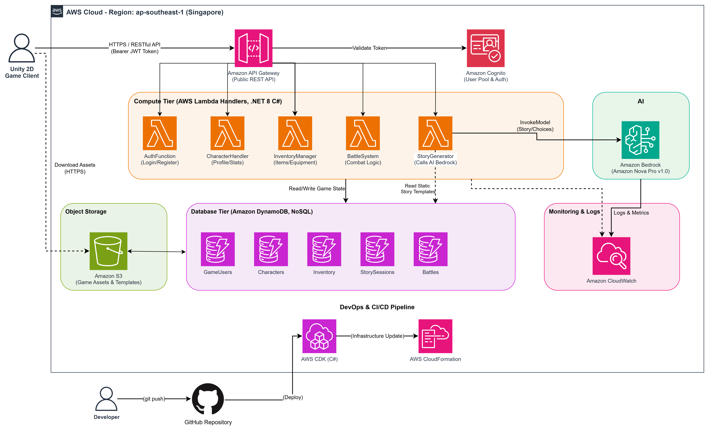

#### Giới thiệu dự án AI Dungeon RPG Adventure

Trong thực tế, việc xây dựng trò chơi nhập vai nhiều người chơi (RPG) đòi hỏi các studio game phải đầu tư một lượng lớn máy chủ tĩnh (Dedicated Servers) để tính toán liên tục. Tuy nhiên, kiến trúc này thường lãng phí tài nguyên khi ít người chơi và dễ gặp sự cố nghẽn mạng khi lưu lượng tăng vọt. 

Để giải quyết bài toán này, workshop của chúng ta sẽ ứng dụng mô hình **Serverless (Không máy chủ)** trên hạ tầng AWS. Điều này giúp các nhà phát triển tập trung 100% vào việc thiết kế tính năng trò chơi, hệ thống tự động co giãn và chỉ tính phí khi có người chơi tương tác.

Bên cạnh đó, thay vì một kịch bản tĩnh truyền thống, "trí não" của game được điều khiển bởi AI tạo sinh, tạo ra trải nghiệm phiêu lưu hoàn toàn khác biệt mỗi khi bạn chơi.

#### Mô hình kiến trúc hệ thống (System Architecture)

Hệ thống được thiết kế theo hướng sự kiện (Event-Driven Architecture) với các tầng dịch vụ tách biệt rõ ràng, đảm bảo tốc độ phản hồi cực nhanh cho các thao tác của người chơi.

*Hình 5.1: Sơ đồ kiến trúc hạ tầng đám mây AWS của hệ thống Game*

Các thành phần chính tham gia vào hệ thống bao gồm:

1. **Presentation Layer (Client)**: 
   - Giao diện trò chơi được lập trình trên Unity 2D. 
   - Kết nối với Backend thông qua các API RESTful bảo mật với JWT Token.

2. **Cổng giao tiếp (API Gateway & Auth)**:
   - **Amazon API Gateway**: Điểm chạm duy nhất đón nhận các yêu cầu HTTP từ Unity Client và chuyển tiếp đến Lambda xử lý.
   - **Amazon Cognito**: Đóng vai trò làm lớp lá chắn bảo mật, quản lý việc đăng ký, đăng nhập và cấp phát Token cho người chơi.

3. **Lớp xử lý nghiệp vụ (Business Logic)**:
   - Các hàm **AWS Lambda** (được viết bằng C# .NET 8) đảm nhận nhiệm vụ riêng biệt như: Tạo nhân vật, Quản lý túi đồ (Inventory), hay Tính toán điểm sát thương khi đánh Boss.

4. **Lớp Dữ liệu và Trí tuệ nhân tạo (Data & AI)**:
   - **Amazon DynamoDB**: Cơ sở dữ liệu NoSQL với độ trễ tính bằng mili-giây, lưu trữ thông tin về nhân vật, vật phẩm và lịch sử các trận đấu.
   - **Amazon Bedrock**: Dịch vụ cung cấp các mô hình ngôn ngữ lớn (LLM). Đóng vai trò là Game Master, nhận ngữ cảnh của nhân vật và sinh ra đoạn văn dẫn chuyện tiếp theo.

Tất cả các thành phần này sẽ được triển khai tự động thông qua mã nguồn bằng công cụ **AWS Cloud Development Kit (CDK)**.
