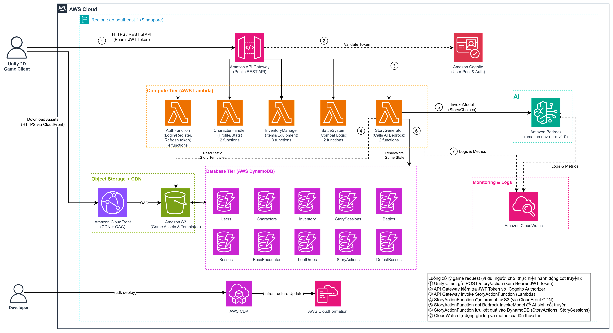
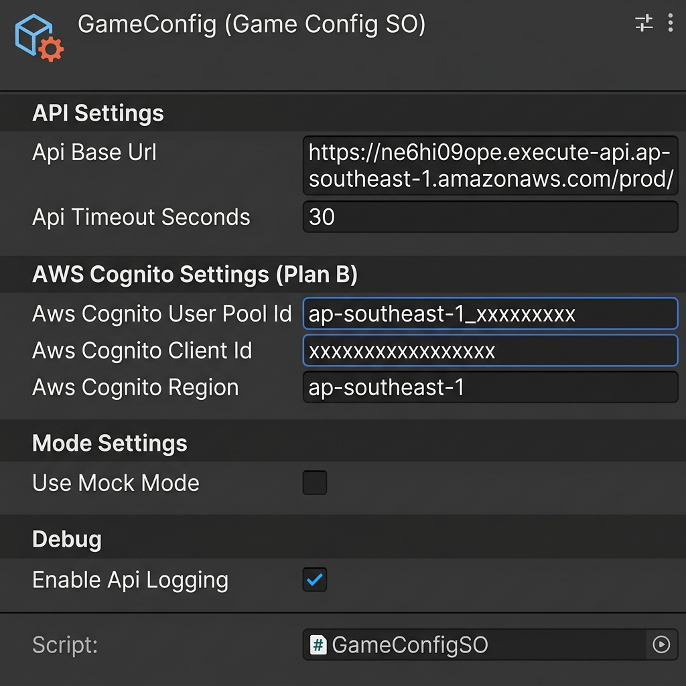
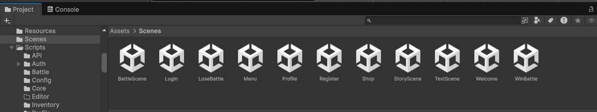

#### Tổng quan Kiến trúc

Kiến trúc của **AI Dungeon RPG Adventure Game** tách biệt hoàn toàn giữa Unity 2D Client và AWS Cloud Backend nhằm đảm bảo tính bảo mật, hiệu năng cao và tối ưu chi phí vận hành.



#### Các thành phần AWS chính

1. **Unity 2D Game Client:**
   - Giao diện người dùng cho Đăng nhập, Tạo/Chọn Nhân vật, Hội thoại Cốt truyện Động và Trận đánh theo lượt.
   - Chia sẻ C# DTOs và Domain Models với Backend thông qua thư viện `shared` (`GameShared.dll`).

2. **Amazon API Gateway & Amazon Cognito:**
   - API Gateway đóng vai trò là điểm tiếp nhận duy nhất cho toàn bộ các endpoint game.
   - Amazon Cognito quản lý đăng ký, đăng nhập và cấp phát JWT token để bảo mật API.

3. **AWS Lambda (.NET 8):**
   - Xử lý logic Serverless hiệu năng cao cho quản lý nhân vật, túi đồ, tính toán sát thương trận đánh và xây dựng prompt cho AI.

4. **AWS Bedrock:**
   - Đóng vai trò là "Dungeon Master AI". Sinh cốt truyện sinh động, phân tích lựa chọn của người chơi và tạo diễn biến trận đánh theo thời gian thực.

5. **Amazon DynamoDB:**
   - Cơ sở dữ liệu NoSQL độ trễ thấp (vài miligiây) lưu trữ thông tin Người dùng, Nhân vật, Vật phẩm, Session Cốt truyện và Boss.

6. **AWS CDK (C#):**
   - Khai báo toàn bộ hạ tầng AWS dưới dạng mã nguồn (IaC) bằng C#, giúp triển khai nhanh chóng và nhất quán.

---

#### Kiến trúc Unity Client

Unity Client được xây dựng theo mô hình **C# Full-Stack Monorepo** chia sẻ data models với backend, áp dụng mô hình kiến trúc **MVP (Model-View-Presenter)** cho toàn bộ màn hình game.



##### Cấu trúc Unity Scenes

Game được tổ chức thành **10 Unity Scenes**, mỗi Scene phục vụ một chức năng riêng biệt:



| Scene | Chức năng |
|---|---|
| `Login.unity` | Đăng nhập với xác thực Cognito |
| `Register.unity` | Đăng ký tài khoản mới |
| `Welcome.unity` | Màn hình chào mừng / loading |
| `Menu.unity` | Hub chính — điều hướng đến tất cả tính năng |
| `Profile.unity` | Chỉ số nhân vật, trang bị và lịch sử |
| `Shop.unity` | Mua bán vật phẩm và quản lý túi đồ |
| `StoryScene.unity` | Cốt truyện dungeon sinh động bởi AI |
| `BattleScene.unity` | Trận đánh turn-based với Boss |
| `WinBattle.unity` | Màn hình chiến thắng và loot phần thưởng |
| `LoseBattle.unity` | Màn hình thất bại và thử lại |

##### Mô hình MVP cho từng tính năng

Mỗi tính năng lớn trong game tuân theo mô hình **Model-View-Presenter**:

```text
Tính năng (ví dụ: Story)
├── StoryModel.cs       — Cấu trúc dữ liệu (trạng thái nhân vật, session data)
├── StoryPresenter.cs   — Logic nghiệp vụ, gọi API, quản lý state
└── StoryView.cs        — Unity UI components, animation, nhận input người dùng
```

| Tính năng | Model | Presenter | View |
|---|---|---|---|
| Story | `StoryModel.cs` | `StoryPresenter.cs` | `StoryView.cs` |
| Battle | `BattleModel.cs` | `BattleService.cs` | `BattleUI.cs` |
| Profile | `ProfileModel.cs` | `ProfilePresenter.cs` | `ProfileView.cs` |
| Inventory | `ItemData.cs` | `InventoryManager.cs` | `InventorySlotUI.cs` |

##### Tích hợp Shared Library

Project `GameShared` (biên dịch dưới dạng `.NET Standard 2.1`) được tự động đồng bộ vào Unity qua PostBuild event:

```xml
<Target Name="PostBuild" AfterTargets="PostBuildEvent">
  <Copy SourceFiles="$(OutputPath)GameShared.dll;$(OutputPath)GameShared.pdb"
        DestinationFolder="../Assets/Plugins"
        SkipUnchangedFiles="true" />
</Target>
```

Nhờ đó, file `Assets/Plugins/GameShared.dll` trong Unity luôn đồng bộ với DTOs và Domain Models của backend — **không bao giờ xảy ra lỗi schema không khớp**.

##### Mock Mode vs Online Mode

ScriptableObject `GameConfigSO` (`Assets/Resources/GameConfig.asset`) kiểm soát hành vi runtime:

```csharp
// Assets/Scripts/Config/GameConfigSO.cs
[CreateAssetMenu(fileName = "GameConfig", menuName = "Game/GameConfig")]
public class GameConfigSO : ScriptableObject
{
    public string apiBaseUrl;           // URL API Gateway AWS
    public string awsCognitoUserPoolId; // Cognito User Pool ID
    public string awsCognitoClientId;   // Cognito App Client ID
    public string awsCognitoRegion;     // ví dụ: "ap-southeast-1"
    public bool   useMockMode;          // true = mock offline, false = AWS thực
    public bool   enableApiLogging;     // Ghi log tất cả HTTP requests ra Console
}
```

Khi `useMockMode = true`, game sử dụng `MockAuthService` với dữ liệu test có sẵn — lý tưởng để phát triển giao diện mà không cần backend đang chạy.
