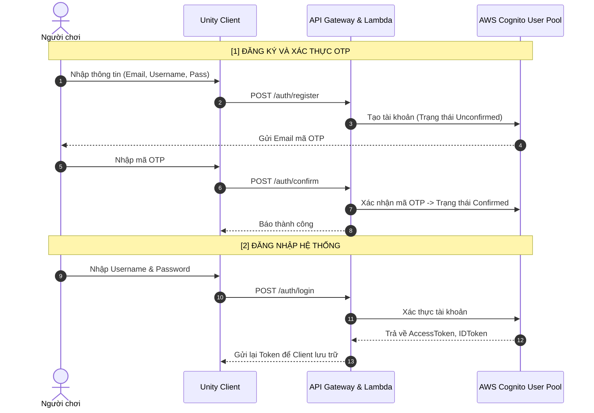
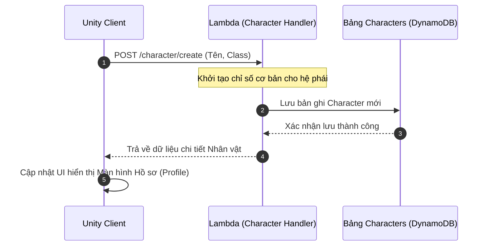
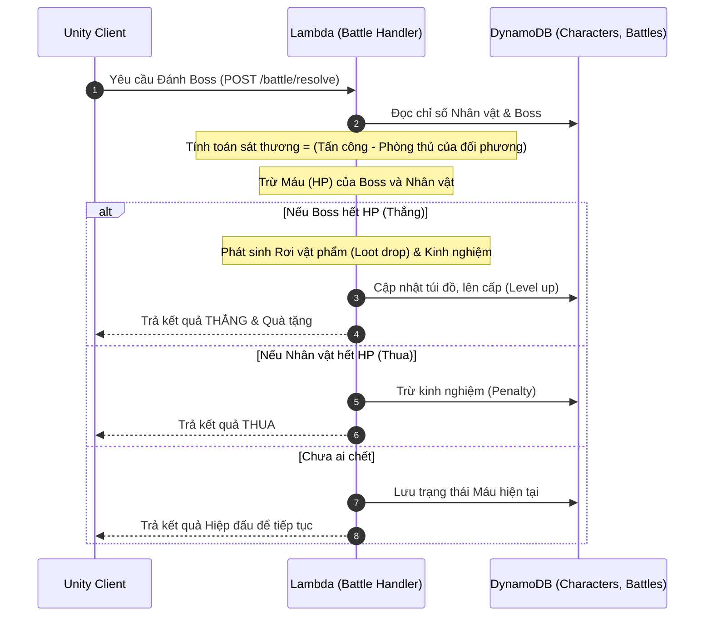

**ỦY BAN NHÂN DÂN TP HỒ CHÍ MINH**

**TRƯỜNG ĐẠI HỌC SÀI GÒN**

**KHOA CÔNG NGHỆ THÔNG TIN**

**Họ và tên sinh viên : Lê Minh Tiến**

**BÁO CÁO**

**THỰC TẬP TỐT NGHIỆP**

| Công ty thực tập:  | Công ty TNHH Amazon Web Services Viet Nam |
| ----: | :---- |
| **Chuyên gia hướng dẫn:** | **Nguyễn Gia Hưng** |
| **Giảng viên hướng dẫn:**  | **ThS. Nguyễn Thanh Sang** |

***TP. Hồ Chí Minh, tháng 8 năm 2026***

MỤC LỤC

[NHẬN XÉT CỦA CHUYÊN GIA DOANH NGHIỆP	i](#nhận-xét-của-chuyên-gia-doanh-nghiệp)

[NHẬN XÉT CỦA GIẢNG VIÊN HƯỚNG DẪN	ii](#nhận-xét-của-giảng-viên-hướng-dẫn)

[LỜI MỞ ĐẦU	1](#lời-mở-đầu)

[PHẦN NỘI DUNG	2](#phần-nội-dung)

[CHƯƠNG 1: GIỚI THIỆU VỀ ĐƠN VỊ THỰC TẬP	2](#chương-1:-giới-thiệu-về-đơn-vị-thực-tập)

[1.1. Giới thiệu	2](#1.1.-giới-thiệu)

[1.1.1. Sơ lược về sự hình thành và phát triển của đơn vị	2](#1.1.1.-sơ-lược-về-sự-hình-thành-và-phát-triển-của-đơn-vị)

[1.1.2. Lĩnh vực hoạt động của doanh nghiệp	2](#1.1.2.-lĩnh-vực-hoạt-động-của-doanh-nghiệp)

[1.1.3. Các đối tác hiện có của doanh nghiệp	2](#1.1.3.-các-đối-tác-hiện-có-của-doanh-nghiệp)

[1.2. Nhiệm vụ thực tập	2](#1.2.-nhiệm-vụ-thực-tập)

[CHƯƠNG 2: QUÁ TRÌNH THỰC TẬP	3](#chương-2:-quá-trình-thực-tập-và-xây-dựng-dự-án)

[2.1. Tìm hiểu về Amazon Web Services (AWS)	3](#heading)

[2.1.1. Tổng quan về AWS	3](#2.1.1.-tổng-quan-về-hạ-tầng-điện-toán-đám-mây-aws-và-mô-hình-serverless)

[2.1.2. Lợi ích của …	3](#2.1.2.-giới-thiệu-đồ-án-thực-tập:-game-2d-nhập-vai-phiêu-lưu-tương-tác-cốt-truyện-bằng-ai)

[2.2. Tìm hiểu quy trình …	3](#2.2.-quá-trình-thực-tập-và-quy-trình-triển-khai-dự-án)

[2.2.1. Quy trình tổng quan về …	3](#2.2.1.-tiến-độ-và-nội-dung-công-việc-theo-giai-đoạn)

[2.3. Mô hình	3](#2.3.-mô-hình-kiến-trúc-hệ-thống-\(system-architecture-design\))

[CHƯƠNG 3: KẾT QUẢ THỰC TẬP	4](#chương-3:-kết-quả-thực-tập)

[3.1.	4](#heading=h.ozz2ulnox0hf)

[3.1.1.	4](#heading=h.vjw3zss5132v)

[3.1.2.	4](#heading=h.d4sjoylfs61m)

[3.1.3.	4](#heading=h.h1vn1pw2fi3g)

[3.1.4.	4](#heading=h.wrgtu2hs3g0x)

[3.2.	4](#heading=h.4x65w0dz82mq)

[3.2.1.	4](#heading=h.vn8tande35kn)

[3.2.2.	4](#heading=h.6pn1xe1hgwnh)

[3.2.3.	4](#heading=h.nhf3juwa7xz8)

[3.2.4.	4](#heading=h.gg7eih3tkihl)

[3.2.5.	4](#heading=h.7saf0rszflpv)

[3.3.	4](#heading=h.f2m4jngbfvzd)

[3.4.	5](#heading=h.4a0smvdo35q1)

[CHƯƠNG 4: KẾT LUẬN VÀ KIẾN NGHỊ	6](#chương-4:-kết-luận-và-kiến-nghị)

[4.1.	6](#heading=h.m43v00jossyg)

[4.2.	6](#heading=h.3is3r22zerke)

[4.3	6](#heading=h.10qwvwd6osrf)

[KẾT LUẬN VÀ HƯỚNG PHÁT TRIỂN	7](#heading=h.9vp82kkuch4)

[TÀI LIỆU THAM KHẢO	10](#tài-liệu-tham-khảo-mẫu)

# **NHẬN XÉT CỦA CHUYÊN GIA DOANH NGHIỆP** {#nhận-xét-của-chuyên-gia-doanh-nghiệp}

																					

**CHUYÊN GIA HƯỚNG DẪN**

**(Ký tên và đóng dấu)**

**Nguyễn Gia Hưng**

# **NHẬN XÉT CỦA GIẢNG VIÊN HƯỚNG DẪN** {#nhận-xét-của-giảng-viên-hướng-dẫn}

																					

**GIẢNG VIÊN HƯỚNG DẪN**

**(Ký tên và đóng dấu)**

**Nguyễn Thanh Sang**

# **LỜI MỞ ĐẦU** {#lời-mở-đầu}

Trong kỷ nguyên số và sự bùng nổ của Cuộc cách mạng Công nghiệp 4.0, Công nghệ Thông tin đã trở thành động lực cốt lõi cho sự phát triển của mọi ngành nghề. Đặc biệt, sự chuyển dịch mạnh mẽ sang nền tảng Điện toán đám mây (Cloud Computing) đang giúp các cá nhân và doanh nghiệp tối ưu hóa chi phí, nâng cao hiệu suất vận hành và nhanh chóng thích ứng với những thay đổi của thị trường. Việc tiếp cận, học tập và làm chủ các công nghệ hạ tầng hiện đại này không chỉ là xu hướng mà còn là yêu cầu cấp thiết đối với lực lượng lao động trẻ ngành IT.

Lời đầu tiên, em xin gửi lời cảm ơn chân thành và sâu sắc nhất đến thầy Nguyễn Thanh Sang – người đã tận tình hướng dẫn, định hướng và đưa ra những góp ý vô cùng quý báu cho em trong suốt thời gian thực hiện đề tài.

Đồng thời, em cũng xin gửi lời cảm ơn chân thành đến Ban lãnh đạo cùng tập thể anh/chị nhân viên tại Công ty TNHH Amazon Web Services Việt Nam đã tạo điều kiện thuận lợi, hỗ trợ chuyên môn và mang lại cho em một môi trường thực tập thực tế chuyên nghiệp để hoàn thành bản báo cáo này.

Nội dung báo cáo thực tập của em bao gồm các phần chính sau:

Chương 1: Giới thiệu về đơn vị thực tập (Amazon Web Services Việt Nam) và nhiệm vụ thực tập

Chương 2: Quá trình thực tập và triển khai công việc

Chương 3: Kết quả thực tập đạt được

Chương 4: Kết luận và kiến nghị

# **PHẦN NỘI DUNG** {#phần-nội-dung}

# **CHƯƠNG 1: GIỚI THIỆU VỀ ĐƠN VỊ THỰC TẬP** {#chương-1:-giới-thiệu-về-đơn-vị-thực-tập}

## **1.1. Giới thiệu** {#1.1.-giới-thiệu}

### **1.1.1. Sơ lược về sự hình thành và phát triển của đơn vị** {#1.1.1.-sơ-lược-về-sự-hình-thành-và-phát-triển-của-đơn-vị}

Amazon Web Services (AWS) là công ty con thuộc Tập đoàn Amazon.com, Inc., được chính thức ra mắt vào năm 2006\. AWS được ghi nhận là đơn vị tiên phong mở ra kỷ nguyên điện toán đám mây (Cloud Computing) trên thế giới. Từ những dịch vụ lưu trữ và máy chủ ảo cơ bản ban đầu, AWS đã phát triển bứt phá thành nền tảng đám mây toàn diện và được áp dụng rộng rãi nhất toàn cầu.

Hiện nay, hạ tầng điện toán đám mây của AWS phủ sóng khắp các khu vực (Regions) và vùng sẵn sàng (Availability Zones) trên toàn thế giới, cung cấp hơn 200 dịch vụ tích hợp từ các trung tâm dữ liệu toàn cầu. AWS liên tục giữ vững vị thế dẫn đầu trong Báo cáo Gartner Magic Quadrant về dịch vụ hạ tầng và nền tảng đám mây trong nhiều năm liên tiếp.

Tại thị trường Việt Nam, Công ty TNHH Amazon Web Services Viet Nam (AWS Việt Nam) được thành lập nhằm hỗ trợ các doanh nghiệp, tổ chức chính phủ, công ty khởi nghiệp (startup) và cộng đồng các nhà phát triển trong nước đẩy nhanh tốc độ chuyển đổi số. Văn phòng làm việc chính của AWS tại TP. Hồ Chí Minh tọa lạc tại vị trí: Tầng 26, Tòa nhà Bitexco số 2 đường Hải Triều, phường Sài Gòn, TP. Hồ Chí Minh, đóng vai trò là trung tâm kết nối, tư vấn giải pháp, tổ chức các hoạt động đào tạo chuyên sâu và phát triển hệ sinh thái công nghệ đám mây cho thị trường Việt Nam.

### **1.1.2. Lĩnh vực hoạt động của doanh nghiệp** {#1.1.2.-lĩnh-vực-hoạt-động-của-doanh-nghiệp}

AWS Việt Nam hoạt động trong lĩnh vực cung cấp hạ tầng, nền tảng công nghệ đám mây và dịch vụ tư vấn chuyển đổi số. Danh mục giải pháp công nghệ của doanh nghiệp bao quát toàn bộ nhu cầu hạ tầng CNTT hiện đại, bao gồm:

* Hạ tầng điện toán và Mạng (Compute & Networking): Máy chủ ảo Amazon EC2, mạng riêng ảo Amazon VPC, dịch vụ điện toán không máy chủ AWS Lambda, cân bằng tải Elastic Load Balancing, bộ định tuyến Route 53, dịch vụ đơn giản hóa triển khai Amazon Lightsail.

* Lưu trữ và Cơ sở dữ liệu (Storage & Databases): Lưu trữ đối tượng Amazon S3, lưu trữ khối Amazon EBS, hệ quản trị cơ sở dữ liệu quan hệ Amazon RDS, cơ sở dữ liệu NoSQL Amazon DynamoDB, bộ nhớ đệm In-memory Amazon ElastiCache.

* Trí tuệ nhân tạo và Học máy (AI/ML & Generative AI): Nền tảng xây dựng ứng dụng AI Amazon Bedrock, môi trường huấn luyện học máy Amazon SageMaker cùng các dịch vụ AI nhận diện hình ảnh, xử lý ngôn ngữ tự nhiên, tổng hợp giọng nói.

* Bảo mật, Định danh và Quản trị (Security, Identity & Governance): Quản lý truy cập AWS IAM, xác thực người dùng Amazon Cognito, quản lý khóa mã hóa AWS KMS, tường lửa ứng dụng AWS WAF, giám sát hệ thống Amazon CloudWatch, quản lý hạ tầng bằng mã AWS CloudFormation và AWS CDK.

* Đào tạo và Phát triển nguồn nhân lực CNTT (Workforce Development): Đồng hành cùng các trường đại học và cộng đồng công nghệ (như AWS Study Group) tổ chức các chương trình đào tạo thực tế như *First Cloud AI Journey (FCAJ)*, *Workforce Bootcamp*, nhằm trang bị kỹ năng thực chiến về Cloud và AI cho thế hệ kỹ sư trẻ tại Việt Nam.

### **1.1.3. Các đối tác hiện có của doanh nghiệp** {#1.1.3.-các-đối-tác-hiện-có-của-doanh-nghiệp}

AWS xây dựng một hệ sinh thái đối tác đa dạng và vững chắc thông qua mạng lưới AWS Partner Network (APN) trên toàn cầu cũng như tại Việt Nam. Các nhóm đối tác chính của AWS bao gồm:

1. Khách hàng Doanh nghiệp lớn và Tập đoàn tại Việt Nam: AWS là hạ tầng cốt lõi cho nhiều đơn vị hàng đầu thuộc các lĩnh vực Tài chính \- Ngân hàng, Bán lẻ, Bưu chính, Công nghệ như: Masan Group, Techcombank, VPBank, VNG, Vietjet Air, Tiki, Chợ Tốt,...

2. Đối tác tư vấn và triển khai kỹ thuật (AWS Consulting Partners): Các công ty công nghệ lớn tại Việt Nam hợp tác chặt chẽ với AWS để cung cấp dịch vụ chuyển đổi số cho khách hàng, tiêu biểu như FPT Software, CMC Telecom, OSAM, VTI Cloud, Renova Cloud,...

3. Đối tác Nhà cung cấp phần mềm độc lập (ISV Partners): Các đơn vị xây dựng phần mềm thương mại chạy trực tiếp hoặc tích hợp sâu trên nền tảng AWS.

4. Đối tác Giáo dục và Cộng đồng Công nghệ: AWS phối hợp cùng các trường Đại học lớn (như Đại học Sài Gòn) và cộng đồng công nghệ chuyên sâu (AWS Study Group, GDGoC) nhằm kết nối, hỗ trợ tài nguyên học tập, tổ chức các sự kiện Community Day và đào tạo sinh viên tiếp cận tiêu chuẩn công nghệ quốc tế.

## **1.2. Nhiệm vụ thực tập**  {#1.2.-nhiệm-vụ-thực-tập}

Trong kỳ thực tập tốt nghiệp này, em may mắn được tiếp nhận vào làm việc và rèn luyện tại Công ty TNHH Amazon Web Services Việt Nam dưới sự hướng dẫn chuyên môn của Chuyên gia Nguyễn Gia Hưng và giảng viên hướng dẫn ThS. Nguyễn Thanh Sang.

Nhiệm vụ thực tập của em gắn liền với chương trình đào tạo thực chiến Workforce Bootcamp \- First Cloud AI Journey (FCAJ) do AWS Việt Nam tổ chức. Các nhiệm vụ trọng tâm được giao trong suốt thời gian thực tập bao gồm:

* Thời gian thực tập: Từ ngày 22/06/2026 đến ngày 15/08/2026.

* Địa điểm làm việc: Văn phòng AWS Việt Nam chi nhánh TP. Hồ Chí Minh (Tầng 26, Tòa nhà Bitexco số 2 đường Hải Triều, phường Sài Gòn, TP. Hồ Chí Minh) kết hợp tự nghiên cứu và làm việc nhóm.

Các nội dung công việc cụ thể:

1. Nghiên cứu một số dịch vụ cơ bản, kiến thức hạ tầng của AWS:

   * Amazon Bedrock: Tích hợp LLM làm AI Dungeon Master dẫn chuyện, tự động sinh cốt truyện và phản hồi theo lựa chọn người chơi.  

   * Amazon Cognito: Quản lý và xác thực người dùng (Đăng ký, Đăng nhập, cấp phát JWT Token an toàn).  

   * Amazon DynamoDB: Cơ sở dữ liệu NoSQL lưu trữ tài khoản, chỉ số nhân vật, túi đồ và lịch sử chơi game.  

   * AWS Lambda & API Gateway: Triển khai Backend Serverless (C\# .NET 8\) xây dựng các API xử lý logic game.  

   * AWS CDK: Tự động hóa khởi tạo và quản lý hạ tầng AWS dưới dạng mã nguồn (IaC).  

   * Amazon S3: Lưu trữ tài nguyên tĩnh, tệp cấu hình và tài liệu báo cáo kỹ thuật.

2. Xây dựng tài liệu hướng dẫn kỹ thuật (Workshop):

   * Tổng hợp kiến thức thực hành, biên soạn bài lab/workshop kỹ thuật, đóng gói và phát hành công khai bài hướng dẫn kỹ thuật trên nền tảng GitHub Pages.

3. Phát triển dự án Game thực tập nhóm (AI Dungeon RPG Adventure Game):

   * Đóng góp xây dựng và kết nối giữa giao diện người dùng Unity 2D (Frontend) với hệ thống Serverless API Backend (.NET 8\) trên AWS.  

   * Hiện thực hóa các tính năng chính trong game: khởi tạo nhân vật, tương tác cốt truyện AI, quản lý trang bị/vật phẩm, và cơ chế chiến đấu theo lượt.

4. Tham gia các sự kiện chuyên môn và sinh hoạt cộng đồng:

   * Tham gia đầy đủ các buổi Meetup chuyên đề chuyên sâu như: *AWS First Cloud Journey AI Meetup*, *FCAJ Community Day*, *AWS FCAJ Agent Forge \- Deepdive*.

   * Lập báo cáo tiến độ công việc định kỳ hàng tuần (Worklog), viết bài chia sẻ kiến thức (Blog Post) và thực hiện tự đánh giá kết quả đạt được sau kỳ thực tập.

**Kết luận chương 1:**

Công ty TNHH Amazon Web Services Việt Nam là đơn vị hàng đầu với vị thế tiên phong trong lĩnh vực Điện toán đám mây và Trí tuệ nhân tạo, chuyên cung cấp các hạ tầng và giải pháp công nghệ hiện đại cho doanh nghiệp. AWS Việt Nam đang là đối tác tin cậy của nhiều tập đoàn và tổ chức lớn trên toàn quốc, mang đến những dịch vụ chất lượng phục vụ cho đa dạng ngành nghề và luôn dẫn đầu trong việc phát triển các công nghệ mới. Môi trường làm việc tại đây đã tạo điều kiện vô cùng thuận lợi cho một thực tập sinh như em có cơ hội tiếp cận với các công nghệ đám mây chuẩn quốc tế, hiểu rõ quy trình làm việc thực tế và rèn luyện tác phong chuyên nghiệp trong lĩnh vực công nghệ thông tin.

 

# **CHƯƠNG 2: QUÁ TRÌNH THỰC TẬP VÀ XÂY DỰNG DỰ ÁN** {#chương-2:-quá-trình-thực-tập-và-xây-dựng-dự-án}

**Nội dung thực tập cụ thể:**

| Tuần 1 (22/06/2026 – 26/06/2026) |  |
| :---- | :---- |
| 22/06 | \- Đến văn phòng AWS Việt Nam (Tầng 26 Bitexco), nhận vị trí làm việc và làm quen môi trường.\- Gặp Chuyên gia hướng dẫn (Anh Nguyễn Gia Hưng) nghe phổ biến quy định và định hướng nhiệm vụ.\- Tham gia buổi khởi động chuỗi chương trình First Cloud AI Journey (FCAJ). |
| 23/06 | \- Cài đặt môi trường phát triển: AWS CLI, C\# .NET 8 SDK, AWS CDK Toolkit.\- Đọc tài liệu về kiến trúc Serverless và mô hình trách nhiệm chia sẻ (Shared Responsibility Model) của AWS. |
| 24/06 | \- Nghiên cứu tài liệu dịch vụ Amazon Cognito (User Pool, Client App, Auth Flow).\- Tạo thử nghiệm User Pool đơn giản trên AWS Console để nắm rõ luồng gửi OTP. |
| 25/06 | \- Tìm hiểu dịch vụ cơ sở dữ liệu Amazon DynamoDB (Single Table Design vs Multi-Table, Partition Key, Sort Key).\- Thực hành các câu lệnh CRUD cơ bản bằng AWS SDK trên C\#. |
| 26/06 | \- Báo cáo tiến độ công việc tuần 1 cho Chuyên gia hướng dẫn.\- Lập kế hoạch chi tiết cho công việc tuần tiếp theo. |
| **Tuần 2 (29/06/2026 – 03/07/2026)** |  |
| 29/06 | \- Tìm hiểu về Amazon Bedrock và các mô hình Foundation Models (Claude, Titan).\- Đọc tài liệu hướng dẫn kỹ thuật Prompt Engineering cơ bản. |
| 30/06 | \- Thực hành gọi API Amazon Bedrock bằng AWS SDK C\# trong dự án Console thử nghiệm.\- Thảo luận nhóm về ý tưởng dự án game RPG tương tác dẫn chuyện bằng AI. |
| 01/07 | \- Phân tích yêu cầu bài toán, thống nhất kiến trúc tổng thể cho game AI Dungeon RPG Adventure Game.\- Phân chia nhiệm vụ phát triển các thành phần Backend (.NET 8\) và Frontend (Unity 2D). |
| 02/07 | \- Tìm hiểu công cụ Infrastructure as Code với AWS CDK trong C\#.\- Cấu hình dự án CDK ban đầu và viết Stack khởi tạo bảng DynamoDB (DatabaseStack). |
| 03/07 | \- Review mã nguồn CDK với nhóm, thực hiện cdk deploy lên môi trường AWS Dev.\- Cập nhật công việc vào file Worklog cá nhân. |
| **Tuần 3 (06/07/2026 – 10/07/2026)** |  |
| 06/07 | \- Bắt đầu tổng hợp kiến thức đã học để biên soạn tài liệu hướng dẫn kỹ thuật (Workshop).\- Viết phần 1 Workshop: Hướng dẫn khởi tạo tài nguyên hạ tầng AWS bằng AWS CDK. |
| 07/07 | \- Viết phần 2 Workshop: Hướng dẫn tích hợp Amazon Cognito và Amazon Bedrock vào ứng dụng C\#.\- Cấu hình GitHub Pages để đóng gói và xuất bản bài Workshop. |
| 08/07 | \- Hoàn thiện trang web Workshop kỹ thuật cá nhân tại địa chỉ fcj-workshop.\- Đưa link Workshop cho anh chị hướng dẫn review và tiếp thu ý kiến chỉnh sửa. |
| 09/07 | \- Thiết kế chi tiết sơ đồ Data Schema cho game trên DynamoDB: Bảng Users, Characters, Inventories, StorySessions, Battles. |
| 10/07 | \- Tạo tài liệu thiết kế API RESTful chi tiết cho các luồng Auth, Story, Inventory và Battle.\- Tổng kết tiến độ tuần 3\. |
| **Tuần 4 (13/07/2026 – 17/07/2026)** |  |
| 13/07 | \- Khởi tạo cấu trúc giải pháp Backend C\# (.NET 8): GameBackend.Core, GameBackend.Handlers, GameShared.\- Lập trình DTOs và Models chung cho các đối tượng trong game. |
| 14/07 | \- Viết dịch vụ CognitoAuthService xử lý logic Đăng ký (RegisterHandler) và Xác nhận OTP (ConfirmSignUpHandler). |
| 15/07 | \- Lập trình logic Đăng nhập (LoginHandler) và Cấp lại Token (RefreshTokenHandler).\- Viết JwtHelper hỗ trợ giải mã và kiểm tra JWT Token. |
| 16/07 | \- Cấu hình API Gateway kết nối với các hàm Lambda Auth qua AWS CDK (ApiStack, LambdaStack).\- Tham gia sự kiện chuyên đề AWS FCAJ Agent Forge \- Deepdive. |
| 17/07 | \- Kiểm thử các API Authentication bằng Postman, đảm bảo sinh Token chính xác.\- Báo cáo kết quả tuần 4\. |
| **Tuần 5 (20/07/2026 – 24/07/2026)** |  |
| 20/07 | \- Xây dựng bộ dựng Prompt (PromptBuilder) đóng vai trò cấu hình hệ thống AI Dungeon Master.\- Thiết kế các mẫu Prompt template cho việc dẫn chuyện, tạo câu hỏi lựa chọn và tóm tắt. |
| 21/07 | \- Lập trình BedrockService để kết nối và truyền nhận dữ liệu JSON với Amazon Bedrock.\- Xây dựng bộ đọc phản hồi AI (StoryAiResponseParser). |
| 22/07 | \- Viết StartStoryHandler xử lý khi người chơi bắt đầu màn chơi mới.\- Viết StoryActionHandler xử lý khi người chơi chọn phương án hành động tương tác. |
| 23/07 | \- Lập trình StorySummaryService để tự động tóm tắt lịch sử diễn biến khi lượt chơi kéo dài.\- Viết Unit Test kiểm thử logic đọc/cập nhật trạng thái câu chuyện (StoryStateUpdaterTests). |
| 24/07 | \- Kiểm thử tích hợp luồng dẫn chuyện AI trên môi trường thử nghiệm.\- Cập nhật Worklog và kế hoạch tuần tiếp theo. |
| **Tuần 6 (27/07/2026 – 31/07/2026)** |  |
| 27/07 | \- Lập trình logic quản lý trang bị vật phẩm: EquipItemHandler và UnequipItemHandler.\- Xây dựng bộ kiểm tra luật chơi (GameRuleValidator) đảm bảo người chơi không mặc sai loại trang bị. |
| 28/07 | \- Lập trình logic trận đánh trùm (ResolveBattleHandler): tính toán sát thương, giáp, máu và trả về phần thưởng.\- Tạo dữ liệu mẫu các con Boss (dragon\_king, goblin\_king). |
| 29/07 | \- Mở dự án Unity 2D Client, tạo các Scene giao diện cơ bản: Login, Register, Character Creation.\- Lập trình AuthManager và ApiClient trên Unity để gọi API Auth. |
| 30/07 | \- Thiết kế giao diện Story Scene, Inventory UI và Battle Scene trên Unity.\- Lập trình các Controller điều khiển UI (StoryPresenter, ProfilePresenter).\- Tham gia sự kiện FCAJ Community Day. |
| 31/07 | \- Tích hợp âm thanh (tiếng click nút, nhạc nền, hiệu ứng nhặt đồ) vào Unity Client.\- Tổng kết công việc tuần 6\. |
| **Tuần 7 (03/08/2026 – 07/08/2026)** |  |
| 03/08 | \- Kết nối toàn bộ Client Unity 2D với hệ thống AWS Serverless Backend qua API Gateway. |
| 04/08 | \- Tiến hành kiểm thử End-to-End toàn bộ luồng chơi: Đăng ký \-\> Tạo nhân vật \-\> Tương tác AI Story \-\> Mặc trang bị \-\> Đánh Boss. |
| 05/08 | \- Phát hiện và sửa các lỗi phát sinh (mất kết nối Token, sai lệch hiển thị chỉ số, lỗi đọc định dạng JSON từ Bedrock). |
| 06/08 | \- Cải thiện tốc độ phản hồi từ AI bằng cách tối ưu hóa số lượng lượt chơi lưu trong Prompt Context. |
| 07/08 | \- Đóng gói bản build Unity 2D thử nghiệm.\- Báo cáo kết quả kiểm thử chạy thực tế với Chuyên gia hướng dẫn. |
| **Tuần 8 (10/08/2026)** |  |
| 10/08 | \- Thống kê tài nguyên, đo đạc độ trễ API và hiệu năng sử dụng dịch vụ AWS. |

## **2.1. Tìm hiểu nền tảng Điện toán đám mây AWS và Giới thiệu Đồ án Thực tập**

### **2.1.1. Tổng quan về Hạ tầng Điện toán đám mây AWS và Mô hình Serverless** {#2.1.1.-tổng-quan-về-hạ-tầng-điện-toán-đám-mây-aws-và-mô-hình-serverless}

Trong kỷ nguyên phát triển phần mềm hiện đại, việc xây dựng ứng dụng trên hạ tầng máy chủ truyền thống thường gặp nhiều hạn chế về chi phí đầu tư ban đầu, thời gian triển khai và khả năng mở rộng quy mô. Nền tảng điện toán đám mây Amazon Web Services (AWS) cung cấp mô hình **Serverless (Không máy chủ)** giúp giải quyết triệt để các vấn đề này. 

Kiến trúc Serverless cho phép các nhà phát triển tập trung hoàn toàn vào việc viết mã nguồn xử lý logic nghiệp vụ mà không cần tốn thời gian quản lý, cấu hình hay bảo trì máy chủ vật lý. Hệ thống sẽ tự động cấp phát tài nguyên khi có lượt truy cập (Request) và tự động thu hồi khi nhàn rỗi, từ đó giúp tối ưu hóa chi phí vận hành theo mô hình "Pay-as-you-go" (chỉ trả tiền cho tài nguyên thực sự sử dụng).

### **2.1.2. Giới thiệu đồ án thực tập: Game 2D nhập vai phiêu lưu tương tác cốt truyện bằng AI** {#2.1.2.-giới-thiệu-đồ-án-thực-tập:-game-2d-nhập-vai-phiêu-lưu-tương-tác-cốt-truyện-bằng-ai}

Gắn liền với nội dung đào tạo thực chiến trong chương trình *First Cloud AI Journey (FCAJ)* tại AWS Việt Nam, em cùng nhóm thực tập đã đăng ký và triển khai đồ án game 2D này. 

* Ý tưởng đồ án: Đây là một trò chơi nhập vai phiêu lưu (RPG) 2D kết hợp với Trí tuệ nhân tạo tạo sinh (Generative AI). Khác với các tựa game RPG truyền thống vốn có kịch bản cố định, trò chơi tích hợp AI dẫn chuyện để tự động tạo ra diễn biến câu chuyện, các tình huống phiêu lưu và hệ thống lựa chọn tương tác hoàn toàn độc nhất dựa trên mọi quyết định của người chơi. 

* Mục tiêu kỹ thuật:

  1. Xây dựng giao diện trò chơi đồ họa 2D trực quan trên nền tảng Unity (Client). 

  2. Triển khai hệ thống Backend Serverless hoàn toàn trên đám mây AWS bằng ngôn ngữ C\# (.NET 8). 

  3. Ứng dụng mô hình AI tạo sinh từ Amazon Bedrock để quản lý logic dẫn chuyện và tương tác linh hoạt với người chơi. 

  4. Quản lý đồng bộ trạng thái nhân vật, vật phẩm, tài khoản và lịch sử trận đánh trùm (Boss) trên cơ sở dữ liệu NoSQL. 

### **2.1.3. Định hướng ứng dụng các dịch vụ AWS cốt lõi trong việc làm game**

Để hiện thực hóa các tính năng của game, các dịch vụ đám mây AWS được lựa chọn đóng vai trò là "xương sống" cho toàn bộ hệ thống Backend: 

* Amazon Bedrock: Đóng vai trò là "trí não" của game (AI dẫn chuyện). Tiếp nhận thông tin về chỉ số nhân vật, vật phẩm đang sở hữu và 5 lượt chơi gần nhất để sinh ra đoạn văn dẫn chuyện, 3 phương án lựa chọn mới và tự động tóm tắt cốt truyện. 

* Amazon Cognito: Đảm nhận chức năng quản lý định danh và xác thực người dùng (Đăng ký, Đăng nhập, gửi mã xác nhận OTP qua Email). Cấp phát mã mã hóa JWT Token an toàn cho Unity Client. 

* Amazon DynamoDB: Lưu trữ dữ liệu NoSQL với độ trễ cực thấp. Chịu trách nhiệm lưu trữ thông tin tài khoản người dùng, chỉ số nhân vật (FighterStats), danh mục trang bị (Inventory), nhật ký màn chơi (StorySession) và trạng thái giao tranh (Battle). 

* AWS Lambda & Amazon API Gateway: Bộ đôi xử lý Backend Serverless. API Gateway tiếp nhận các yêu cầu HTTP/HTTPS từ Unity Client, kiểm tra tính hợp lệ của JWT Token và chuyển tiếp cho các hàm C\# AWS Lambda thực thi nghiệp vụ. 

* AWS Cloud Development Kit (AWS CDK): Cho phép định nghĩa toàn bộ hạ tầng cloud bằng mã nguồn C\# (IaC). Toàn bộ tài nguyên được khởi tạo tự động, đồng bộ và dễ dàng quản lý phiên bản thông qua các Stack (ApiStack, CognitoStack, DatabaseStack, LambdaStack).

## **2.2. Quá trình thực tập và quy trình triển khai dự án** {#2.2.-quá-trình-thực-tập-và-quy-trình-triển-khai-dự-án}

### **2.2.1. Tiến độ và nội dung công việc theo giai đoạn** {#2.2.1.-tiến-độ-và-nội-dung-công-việc-theo-giai-đoạn}

Nhiệm vụ thực tập được chia thành các giai đoạn cụ thể nhằm đảm bảo kết hợp giữa việc học lý thuyết, thực hành lab và triển khai sản phẩm thực tế: 

* Giai đoạn 1: Tiếp cận kiến thức đám mây và tham gia sự kiện chuyên môn

  * Tham gia các buổi đào tạo thực chiến trong chuỗi chương trình *First Cloud AI Journey (FCAJ)* và sinh hoạt tại văn phòng AWS Bitexco. 

  * Tìm hiểu cách vận hành dịch vụ Serverless, Generative AI và cách cấu hình bảo mật IAM Role/Policy. 

* Giai đoạn 2: Biên soạn tài liệu kỹ thuật (Workshop)

  * Tổng hợp quy trình tích hợp các dịch vụ AWS và đóng gói thành bài hướng dẫn kỹ thuật thực hành (Workshop). 

  * Phát hành tài liệu kỹ thuật công khai trên nền tảng GitHub Pages. 

* Giai đoạn 3: Phân tích và thiết kế hệ thống Game

  * Lên ý tưởng và thiết kế kịch bản game RPG nhập vai dẫn chuyện bằng AI. 

  * Xây dựng cấu trúc dữ liệu Backend bằng C\# .NET 8 (GameBackend.Core, GameBackend.Handlers) và viết kịch bản hạ tầng AWS CDK. 

* Giai đoạn 4: Phát triển Backend Serverless & Tích hợp Bedrock AI

  * Triển khai các API xử lý Authentication (Login, Register, RefreshToken). 

  * Viết module PromptBuilder kết hợp với Amazon Bedrock để xử lý logic dẫn chuyện tương tác. 

  * Hiện thực hóa logic giao tranh (BattleResolve), rơi đồ (LootDrop) và quản lý trang bị (Equip/Unequip Item). 

* Giai đoạn 5: Phát triển Unity Client & Kiểm thử tích hợp (End-to-End)

  * Thiết kế giao diện Unity 2D (Login, Main Menu, Story Scene, Inventory, Battle Scene). 

  * Viết các ApiService kết nối HTTP Client giữa Unity và API Gateway. 

  * Kiểm thử toàn bộ luồng chơi (End-to-End Testing) và tối ưu hóa thời gian phản hồi từ AI. 

### **2.2.2. Quy trình xử lý luồng công việc chính trong game**

Hệ thống của trò chơi được phân chia thành 5 luồng hoạt động (flows) chính, được quản lý độc lập thông qua kiến trúc Serverless (Không máy chủ). Sự phân chia này giúp hệ thống dễ dàng mở rộng và bảo trì, đồng thời mang lại trải nghiệm mượt mà cho người chơi từ lúc bắt đầu cho đến khi tương tác sâu vào cốt truyện. Dưới đây là chi tiết và sơ đồ của từng luồng.

#### **A. Luồng Quản lý Tài khoản & Định danh (Authentication Flow)**

**Mô tả luồng:** 
Đây là bước đầu tiên để người chơi có thể truy cập vào hệ thống game. Quá trình này đảm bảo tính bảo mật và định danh cho từng người dùng thông qua dịch vụ AWS Cognito.
1. **Đăng ký (Register):** Người chơi nhập thông tin vào Client. Hệ thống sẽ gọi API `/auth/register` để tạo tài khoản, đồng thời Amazon Cognito sẽ tự động gửi mã xác nhận OTP qua email.
2. **Xác nhận (Confirm):** Người chơi nhập mã OTP lên Client để kích hoạt tài khoản thông qua API `/auth/confirm`.
3. **Đăng nhập (Login):** Sau khi xác thực thành công qua API `/auth/login`, Cognito cấp một mã thông báo (Access Token) an toàn. Token này sẽ được Unity Client đính kèm vào mọi yêu cầu truy xuất dữ liệu sau này để xác minh quyền truy cập.

**Sơ đồ hoạt động:**


*[[Ghi chú cho sinh viên: Chèn Hình ảnh minh họa UI Giao diện Đăng nhập / Đăng ký của Unity vào đây]]*
**Hình 2.2: Giao diện Đăng nhập và Đăng ký tài khoản trên Unity Client**

| Tên Module | Chức năng (Nút bấm / Thao tác) | Tác vụ xử lý |
| :--- | :--- | :--- |
| **Đăng ký** | Nút `Đăng ký` | Kiểm tra tính hợp lệ của dữ liệu đầu vào và gọi API tạo tài khoản. |
| **Xác thực OTP** | Nút `Xác nhận mã` | Gửi mã OTP người dùng nhập để kích hoạt tài khoản. |
| **Đăng nhập** | Nút `Đăng nhập` | Gửi thông tin và nhận JWT Token từ Backend. |

#### **B. Luồng Khởi tạo và Truy xuất Nhân vật (Character Management Flow)**

**Mô tả luồng:** 
Sau khi đăng nhập thành công, nếu là người chơi mới, họ bắt buộc phải tạo một nhân vật (Character) trước khi bắt đầu cuộc phiêu lưu. 
1. **Tạo nhân vật:** Người chơi chọn lớp nhân vật (Class) và đặt tên. Hệ thống gọi API `/character/create`. Backend Lambda sẽ cấp cho nhân vật các chỉ số khởi đầu cơ bản (Máu, Sức mạnh, Phòng thủ, Tiền vàng) và lưu vào cơ sở dữ liệu DynamoDB (Bảng `Characters`).
2. **Truy xuất thông tin:** Ở những lần đăng nhập sau, Unity Client chỉ cần gọi API lấy thông tin nhân vật dựa trên ID tài khoản để hiển thị màn hình hồ sơ, không cần phải tạo lại từ đầu.

**Sơ đồ hoạt động:**


*[[Ghi chú cho sinh viên: Chèn Hình ảnh minh họa Giao diện Tạo nhân vật và Hồ sơ vào đây]]*
**Hình 2.3: Giao diện Khởi tạo nhân vật và Màn hình Hồ sơ (Profile)**

| Tên Module | Chức năng (Nút bấm / Thao tác) | Tác vụ xử lý |
| :--- | :--- | :--- |
| **Tạo nhân vật** | Nút `Tạo mới` | Gửi dữ liệu Class và Tên nhân vật lên máy chủ để khởi tạo chỉ số. |
| **Hồ sơ (Profile)** | Load giao diện | Tự động gọi API lấy thông tin cấp độ, máu, sát thương để hiển thị. |


#### **C. Luồng Dẫn chuyện tương tác AI (AI Story Engine Flow)**

**Mô tả luồng:** 
Đây là luồng hoạt động mang tính cốt lõi và sáng tạo nhất của trò chơi, sử dụng AI tạo sinh để mang lại trải nghiệm không trùng lặp.
1. **Khởi tạo và Tương tác:** Người chơi gọi API `/story/start` để bắt đầu, hoặc `/story/action` để gửi một quyết định/hành động mà họ muốn làm.
2. **Xử lý Ngữ cảnh (Context):** Backend Lambda thu thập toàn bộ lịch sử các vòng chơi trước đó từ DynamoDB (Bảng `StorySessions`), kết hợp với chỉ số nhân vật hiện tại để tạo thành một khối Prompt định dạng chuẩn.
3. **Sinh nội dung với LLM:** Khối Prompt này được gửi đến dịch vụ Amazon Bedrock. Mô hình ngôn ngữ lớn (LLM) sẽ suy luận và trả lời dưới dạng JSON, bao gồm: nội dung diễn biến tiếp theo của câu chuyện và 3 lựa chọn mới tùy biến theo tình huống.

**Sơ đồ hoạt động:**
```mermaid
flowchart TD
    A[Người chơi chọn 1 Hành động] --> B(Unity Client gọi API /story/action)
    B --> C{Lambda xử lý Prompt}
    C -->|Lấy dữ liệu 5 lượt gần nhất| D[(DynamoDB - StorySessions)]
    C -->|Lấy chỉ số nhân vật| E[(DynamoDB - Characters)]
    D --> F[Tổng hợp Prompt Template]
    E --> F
    F --> G[Gửi yêu cầu tới Amazon Bedrock (LLM)]
    G --> H{Xử lý JSON trả về}
    H -->|Phân tách| I[Diễn biến cốt truyện mới]
    H -->|Phân tách| J[3 Phương án lựa chọn mới]
    I --> K(Cập nhật giao diện Story Scene trên Unity)
    J --> K
```

*[[Ghi chú cho sinh viên: Chèn Hình ảnh minh họa Giao diện Story Scene (Dẫn chuyện và 3 nút lựa chọn) vào đây]]*
**Hình 2.4: Giao diện màn hình Dẫn chuyện AI (Story Scene)**

| Tên Module | Chức năng (Nút bấm / Thao tác) | Tác vụ xử lý |
| :--- | :--- | :--- |
| **Dẫn chuyện** | Ô hiển thị Text | Hiển thị văn bản cốt truyện do AI sinh ra. |
| **Lựa chọn** | Nút `Hành động 1, 2, 3` | Gửi quyết định của người chơi lên Server để AI tạo ra tình huống tiếp theo. |

#### **D. Luồng Quản lý Túi đồ và Vật phẩm (Inventory & Item Flow)**

**Mô tả luồng:** 
Quản lý tài nguyên, vật phẩm là cơ chế không thể thiếu của các game nhập vai RPG. 
1. **Truy xuất túi đồ:** Lấy toàn bộ danh sách các vật phẩm mà người chơi đang sở hữu thông qua API `/inventory/get`.
2. **Thao tác với vật phẩm:** Người chơi có thể Trang bị (Equip) hoặc Tháo (Unequip) vũ khí, áo giáp. Lambda sẽ thực hiện kiểm tra điều kiện (Validate) – ví dụ: không thể mặc 2 thanh kiếm cùng lúc, và tự động tính toán, cộng trừ các chỉ số Sức mạnh/Phòng thủ tương ứng vào bảng `Characters` trên Database. Nếu sử dụng bình máu (Use), hệ thống sẽ tính toán hồi phục HP.

**Sơ đồ hoạt động:**
```mermaid
flowchart TD
    A[Mở giao diện Túi đồ] --> B(Gọi API Lấy danh sách Item)
    B --> C{Người chơi thao tác}
    
    C -->|Chọn Trang bị (Equip)| D[Kiểm tra vị trí trống (Slot)]
    D -->|Hợp lệ| E[Cộng chỉ số Tấn công/Giáp]
    
    C -->|Chọn Tháo (Unequip)| F[Kiểm tra vật phẩm đang mặc]
    F -->|Hợp lệ| G[Trừ chỉ số Tấn công/Giáp]

    C -->|Dùng (Use) bình máu| H[Kiểm tra lượng vật phẩm]
    H -->|Còn hàng| I[Hồi phục HP cho Nhân vật]

    E --> J[(Cập nhật bảng Characters và Inventory trong DB)]
    G --> J
    I --> J
    J --> K(Unity Client đồng bộ UI mới)
```

*[[Ghi chú cho sinh viên: Chèn Hình ảnh minh họa Giao diện Túi đồ (Inventory) vào đây]]*
**Hình 2.5: Giao diện Túi đồ (Inventory) và tính năng Quản lý Vật phẩm**

| Tên Module | Chức năng (Nút bấm / Thao tác) | Tác vụ xử lý |
| :--- | :--- | :--- |
| **Túi đồ** | Giao diện Lưới (Grid) | Liệt kê các vật phẩm đang có, chia theo danh mục (Vũ khí, Giáp, Đồ tiêu hao). |
| **Trang bị** | Nút `Trang bị / Tháo` | Cập nhật trạng thái vật phẩm và tính toán lại chỉ số của nhân vật. |

#### **E. Luồng Khởi tạo và Giải quyết Giao tranh (Battle System Flow)**

**Mô tả luồng:** 
Khi tình tiết cốt truyện dẫn đến một cuộc chiến với Trùm (Boss), luồng chiến đấu sẽ được kích hoạt.
1. **Khởi tạo:** API `/battle/spawn` sinh ra thông số của một con quái vật và tạo bản ghi lưu trận đấu vào bảng `Battles`.
2. **Giao tranh:** Người chơi chọn Tấn công hoặc Phòng thủ thông qua API `/battle/resolve`. Server sẽ sử dụng thuật toán tính toán sát thương dựa trên (Sức mạnh - Phòng thủ) và đánh giá lượng Máu còn lại để phân định kết quả Thắng/Thua. Sau trận đánh, nếu Thắng, hệ thống sẽ tự động rơi (loot) vật phẩm phần thưởng và cộng Kinh nghiệm cho người chơi.

**Sơ đồ hoạt động:**


*[[Ghi chú cho sinh viên: Chèn Hình ảnh minh họa Giao diện Đánh Boss (Battle Scene) vào đây]]*
**Hình 2.6: Giao diện Màn hình Giao tranh (Battle Scene)**

| Tên Module | Chức năng (Nút bấm / Thao tác) | Tác vụ xử lý |
| :--- | :--- | :--- |
| **Giao tranh** | Chỉ số Máu (HP Bar) | Cập nhật trực quan lượng máu còn lại của cả 2 phe sau mỗi hiệp. |
| **Hành động** | Nút `Tấn công / Phòng thủ` | Gửi lựa chọn chiến thuật lên máy chủ để tính toán thuật toán chiến đấu. |


## **2.3. Mô hình kiến trúc hệ thống (System Architecture Design)** {#2.3.-mô-hình-kiến-trúc-hệ-thống-(system-architecture-design)}

### **2.3.1. Sơ đồ kiến trúc tổng quan (Overall System Architecture)**

Hệ thống Backend cho trò chơi được thiết kế và triển khai hoàn toàn theo mô hình Không máy chủ dựa trên sự kiện (Serverless Event-Driven Architecture) trên khu vực hạ tầng ap-southeast-1 (Singapore) của AWS. Kiến trúc này giúp tối ưu hóa chi phí vận hành, đảm bảo tính sẵn sàng cao và khả năng tự động mở rộng khi số lượng người chơi tăng đột biến.  Mô hình kiến trúc tổng quan cùng sự tương tác giữa các dịch vụ AWS trong hệ thống được thể hiện chi tiết trong hình dưới:

Hình 2-1: Sơ đồ kiến trúc hạ tầng đám mây AWS của hệ thống Game

Hệ thống được phân thành các tầng (Tiers) và thành phần chức năng chính sau:

Lớp Presentation Layer \- Unity 2D: Giao diện trò chơi chạy trên thiết bị người chơi, chịu trách nhiệm xử lý đồ họa 2D, âm thanh và gửi các yêu cầu HTTPS/RESTful API đính kèm mã xác thực Bearer JWT Token đến hệ thống Backend.

Lớp Cổng API và Xác thực (API Gateway & Authentication Tier):

* Amazon API Gateway: Đóng vai trò là cổng giao tiếp công khai (Public REST API), tiếp nhận toàn bộ các yêu cầu từ Client và định tuyến đến các hàm Lambda xử lý tương ứng.  
* Amazon Cognito: Phối hợp cùng API Gateway để xác thực mã JWT Token, đảm bảo chỉ các yêu cầu hợp lệ mới được phép truy cập vào hệ thống. 

Lớp Xử lý nghiệp vụ (Business Logic Layer lưu trong AWS Lambda): Bao gồm các hàm Serverless được viết bằng ngôn ngữ C\# (.NET 8), đảm nhận từng nghiệp vụ riêng biệt: 

* AuthFunction: Xử lý đăng ký, đăng nhập và xác thực mã OTP. 

* CharacterHandler: Quản lý thông tin cá nhân và chỉ số nhân vật. 

* InventoryManager: Quản lý vật phẩm, trang bị và túi đồ. 

* BattleSystem: Tính toán logic giao tranh và các trận chạm trán Trùm (BossEncounter). 

* StoryGenerator: Xử lý logic câu chuyện và giao tiếp với mô hình AI Bedrock.

Lớp Data và AI:

* Amazon Bedrock: Kết nối mô hình ngôn ngữ lớn (LLM) đóng vai trò làm Người dẫn chuyện AI để sinh nội dung câu chuyện và các phương án lựa chọn cho người chơi. 

* Amazon DynamoDB: Cơ sở dữ liệu NoSQL lưu trữ toàn bộ trạng thái game qua các bảng: GameUsers, Characters, Inventory, StorySessions và Battles.

* Amazon S3 (Object Storage): Lưu trữ các tài nguyên tĩnh như tài sản game, hình ảnh và các mẫu template câu chuyện.

Lớp Giám sát và lưu Log (Monitoring & Logs Tier):

* Amazon CloudWatch: Thu thập nhật ký vận hành (Logs) và số liệu hiệu năng (Metrics) từ các hàm Lambda và API Gateway, hỗ trợ theo dõi và phát hiện lỗi hệ thống kịp thời. 

Lớp Quản lý hạ tầng và Tự động hóa (DevOps & CI/CD Pipeline):

* Quy trình phát triển hạ tầng dưới dạng mã nguồn bắt đầu từ việc lập trình viên đẩy mã nguồn C\# lên GitHub Repository. Bộ công cụ AWS CDK sẽ tự động biên dịch thành các kịch bản AWS CloudFormation để triển khai đồng bộ các tài nguyên lên đám mây AWS.

### **2.3.2. Thiết kế Cơ sở dữ liệu NoSQL (Amazon DynamoDB Tables)**

Hệ thống sử dụng cơ sở dữ liệu Amazon DynamoDB được thiết kế theo mô hình NoSQL, tối ưu hóa cho các truy vấn theo khoá dạng Key-Value với độ trễ cực thấp. Cấu trúc chi tiết của 5 bảng dữ liệu cốt lõi phục vụ trò chơi bao gồm:

1. **Bảng GameUsers**: (Quản lý tài khoản người chơi)

   * Partition Key (PK): UserId (GUID) 

   * Attributes: Email, Username, CreatedAt, LastLogin

2. **Bảng Characters**: (Quản lý thông tin nhân vật)

   * Partition Key (PK): CharacterId (GUID) 

   * Attributes: UserId, Name, Class, Level, Experience, Stats (HP, Attack, Defense) 

3. **Bảng Inventory**: (Quản lý vật phẩm & túi đồ)

   * Partition Key (PK): CharacterId

   * Sort Key (SK): ItemId

   * Attributes: Quantity, IsEquipped, ItemType (Weapon, Armor, Potion) 

4. **Bảng StorySessions**: (Lưu trữ tiến trình và nhật ký câu chuyện)

   * Partition Key (PK): SessionId (GUID) 

   * Attributes: CharacterId, CurrentChapter, Location, HistoryTurns (List các lượt tương tác gần nhất), Summary

5. **Bảng Battles**: (Theo dõi trạng thái trận đấu diễn ra)

   * Partition Key (PK): BattleId (GUID) 

   * Attributes: CharacterId, BossId, BossHP, PlayerHP, Status (In Progress, Won, Lost).

**Kết luận Chương 2:**

Trên đây là tổng quan về những công việc và dự án thực tế mà em cùng nhóm đã nỗ lực hoàn thành trong suốt giai đoạn thực tập. Mặc dù thời gian chưa đủ dài để có thể tìm hiểu tường tận mọi quy trình vận hành phức tạp của công ty, nhưng bù lại, em đã tích lũy được rất nhiều kỹ năng mềm và bài học quý giá làm hành trang cho con đường sự nghiệp sau này.

Trong suốt những tuần làm việc, em may mắn nhận được sự hướng dẫn và hỗ trợ vô cùng nhiệt tình từ các anh chị, đặc biệt là anh Hiếu, anh Thiện và anh Nghị. Nhờ các anh, em không chỉ được tiếp cận với những kiến thức chuyên môn, kinh nghiệm thực chiến về việc thiết kế và xây dựng hệ thống trên nền tảng Cloud mà trước đây em chưa từng biết tới, mà còn học được cách làm việc chuyên nghiệp. Qua đó, em nhận ra rằng việc chủ động dành thời gian trao đổi, thấu hiểu những vấn đề trong công ty để mọi người hiểu nhau hơn chính là chìa khóa để nâng cao hiệu suất công việc chung. 

Hơn thế nữa, bài học cốt lõi nhất mà em nhận được không chỉ dừng lại ở việc học "cách" phát triển một sản phẩm công nghệ như thế nào, mà là tư duy phát triển sản phẩm: phải thực sự hiểu rõ sản phẩm đó là gì, mục đích tạo ra để làm gì và phục vụ cho ai. Trong môi trường doanh nghiệp thực tế, việc tối ưu hóa trải nghiệm người dùng và luôn "hướng về khách hàng" (Customer Obsession) chính là yếu tố sống còn quyết định sự thành bại của mọi dự án.

# **CHƯƠNG 3: KẾT QUẢ THỰC TẬP**  {#chương-3:-kết-quả-thực-tập}

Qua 8 tuần thực tập tại Amazon Web Services (AWS) Việt Nam, bắt đầu từ sự bỡ ngỡ ban đầu với một môi trường doanh nghiệp chuẩn quốc tế, em đã nhanh chóng thích nghi và tích lũy được cho mình những hành trang vô cùng quý báu. Về mặt chuyên môn, em đã có cơ hội ứng dụng trực tiếp những kiến thức trên giảng đường vào việc triển khai một dự án thực tế. Em đã nắm bắt được quy trình xây dựng ứng dụng theo kiến trúc Serverless, làm chủ các dịch vụ đám mây cốt lõi như Amazon API Gateway, AWS Lambda, DynamoDB và Cognito. Đặc biệt, việc tiếp cận và tích hợp thành công mô hình ngôn ngữ lớn (LLM) thông qua Amazon Bedrock vào game Unity 2D đã giúp em mở rộng tư duy rất nhiều về tiềm năng của Trí tuệ nhân tạo (Generative AI). Không chỉ dừng lại ở việc học hỏi, em còn hoàn thành và phát hành một tài liệu hướng dẫn kỹ thuật (Workshop), đóng góp một phần công sức nhỏ bé của mình vào cộng đồng học thuật.

Bên cạnh những thành tựu về kỹ thuật, giá trị lớn nhất mà em nhận được chính là sự trưởng thành về kỹ năng mềm và tư duy làm việc. Trong suốt quá trình thực tập, em đã may mắn nhận được sự hỗ trợ nhiệt tình từ các anh chị admin như anh Hiếu, anh Thiện, anh Nghị và đặc biệt là sự dẫn dắt sát sao của chuyên gia hướng dẫn - anh Nguyễn Gia Hưng. Các anh không chỉ truyền đạt kiến thức chuyên sâu về hệ thống cloud mà còn dạy em cách làm việc nhóm, cách trao đổi thẳng thắn để thấu hiểu vấn đề, từ đó nâng cao hiệu suất công việc chung. 

Em cũng đặc biệt thấm nhuần triết lý "Customer Obsession" (Luôn hướng về khách hàng) của Amazon. Em nhận ra rằng việc phát triển sản phẩm không chỉ nằm ở việc code như thế nào, mà còn phải thực sự hiểu rõ mình đang làm gì, giải quyết vấn đề nào và mang lại trải nghiệm tốt nhất cho ai. Nhân đây, em cũng xin gửi lời cảm ơn chân thành đến thầy Nguyễn Thanh Sang – Giảng viên hướng dẫn đã luôn đồng hành, theo sát và đưa ra những lời khuyên kịp thời cho em trong suốt thời gian qua.

(sau đó chèn các mẫu phiếu theo thứ tự, mẫu 6, 7, 8 đã có dấu mộc của doanh nghiệp vào)

**Kết luận chương 3**

Khép lại kỳ thực tập, những đánh giá khách quan và nhận xét tâm huyết từ phía các anh chị chuyên gia tại AWS cũng như của giảng viên hướng dẫn chính là tấm gương phản chiếu trung thực nhất quá trình nỗ lực của em. Những lời nhận xét ấy giúp em nhìn nhận rõ nét hơn về những thế mạnh cần phát huy và những khuyết điểm còn tồn tại khi bước ra khỏi vùng an toàn của giảng đường để dấn thân vào môi trường làm việc chuyên nghiệp. Em xem đó là kim chỉ nam quý báu, định hướng cho những bước phát triển sự nghiệp công nghệ vững vàng hơn trong tương lai.

# **CHƯƠNG 4: KẾT LUẬN VÀ KIẾN NGHỊ** {#chương-4:-kết-luận-và-kiến-nghị}

Nhìn lại hành trình thực tập vừa qua, em cảm thấy vô cùng tự hào khi đã hoàn thành trọn vẹn dự án AI Dungeon RPG Adventure Game bằng việc kết hợp linh hoạt giao diện Unity 2D và nền tảng hạ tầng AWS Serverless mạnh mẽ. Việc ứng dụng thành công các dịch vụ như Lambda, DynamoDB, Cognito và đặc biệt là khai thác sức mạnh của mô hình ngôn ngữ lớn (LLM) qua Amazon Bedrock đã đánh dấu một bước tiến lớn trong nhận thức công nghệ của bản thân. Môi trường làm việc năng động và chuyên nghiệp tại AWS Việt Nam không chỉ trang bị cho em những kiến thức kỹ thuật cốt lõi mà còn rèn luyện tư duy nhạy bén trong việc giải quyết vấn đề và xây dựng sản phẩm thực tế. 

Từ những trải nghiệm quý báu này, em mong muốn gửi gắm một số kiến nghị và kỳ vọng cho tương lai. Đối với công ty AWS, em thực sự hy vọng doanh nghiệp sẽ tiếp tục duy trì và nhân rộng các chương trình thực chiến như First Cloud AI Journey (FCAJ). Đây là cơ hội vàng để các bạn sinh viên trẻ có thể tiếp cận sớm với các công nghệ lõi và văn hóa làm việc đẳng cấp quốc tế. Về phía nhà trường, em kính đề xuất Khoa Công nghệ Thông tin có thể xem xét lồng ghép thêm nhiều chuyên đề chuyên sâu về Điện toán đám mây và Trí tuệ nhân tạo (Generative AI) vào chương trình giảng dạy chính khóa hoặc các hoạt động ngoại khóa. Việc này sẽ giúp sinh viên của trường luôn bắt kịp những xu hướng công nghệ mới nhất của thế giới.

Về phía định hướng bản thân và phát triển dự án, em dự định sẽ tiếp tục tối ưu hóa hệ thống game hiện tại. Mục tiêu sắp tới là cải thiện tốc độ phản hồi của mô hình AI, nâng cao chất lượng Prompt để cốt truyện thêm phần lôi cuốn, và nghiên cứu tích hợp thêm dịch vụ chuyển văn bản thành giọng nói (Amazon Polly) để tăng tính sinh động. Xa hơn nữa, em cũng đặt mục tiêu ôn tập và chinh phục các chứng chỉ chuyên nghiệp của AWS nhằm khẳng định năng lực chuyên môn của mình trên chặng đường sự nghiệp sắp tới.

# **TÀI LIỆU THAM KHẢO** {#tài-liệu-tham-khảo}

[1] AWS Study Group. *"Hệ thống bài giảng chương trình First Cloud AI Journey (FCAJ)"*. Kênh YouTube chính thức. Truy cập tại: https://www.youtube.com/@AWSStudyGroup

[2] AWS Study Group. *"Danh sách Video hướng dẫn thực hành AWS cơ bản và triển khai đồ án"*. YouTube Playlist. Truy cập tại: https://www.youtube.com/watch?v=AQlsd0nWdZk&list=PLahN4TLWtox2a3vElknwzU_urND8hLn1i

[3] AWS Study Group. *"Hệ thống các bài lab thực chiến - Tài liệu làm lab FCAJ Bootcamp"*. Nền tảng học tập Cloud Journey. Truy cập tại: https://cloudjourney.awsstudygroup.com/

[4] Amazon Web Services. *"AWS Official Documentation"* (Tài liệu hướng dẫn kỹ thuật chính thức về Amazon Bedrock, AWS Lambda, Amazon Cognito, Amazon DynamoDB). Truy cập tại: https://docs.aws.amazon.com/

[5] Unity Technologies. *"Unity User Manual 2022 LTS"* (Tài liệu lập trình giao diện 2D và kết nối HTTP Request). Truy cập tại: https://docs.unity3d.com/Manual/index.html

